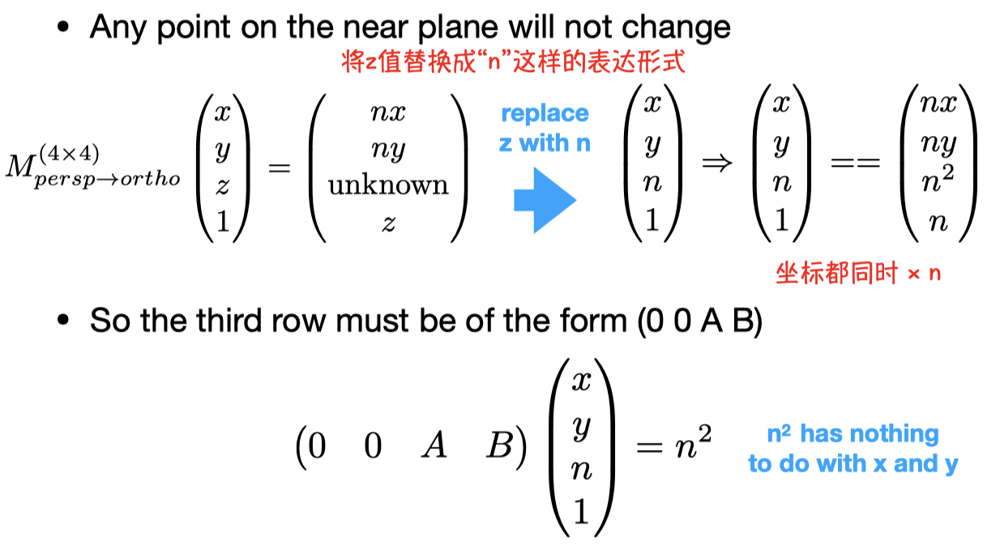
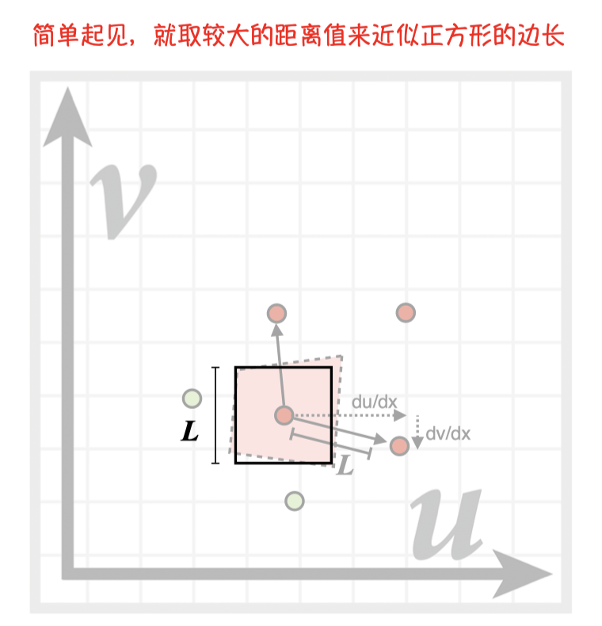
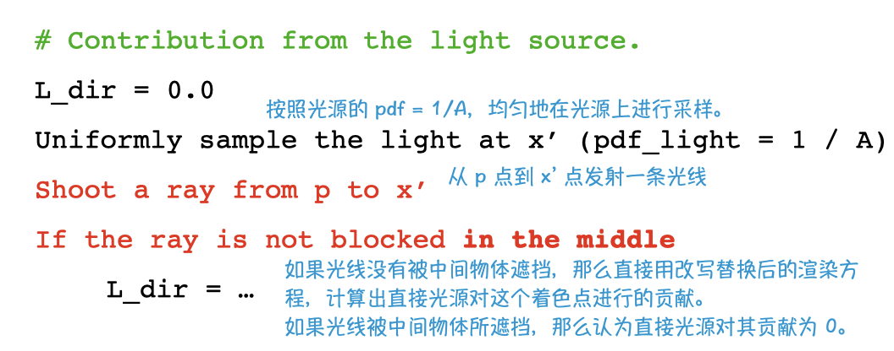
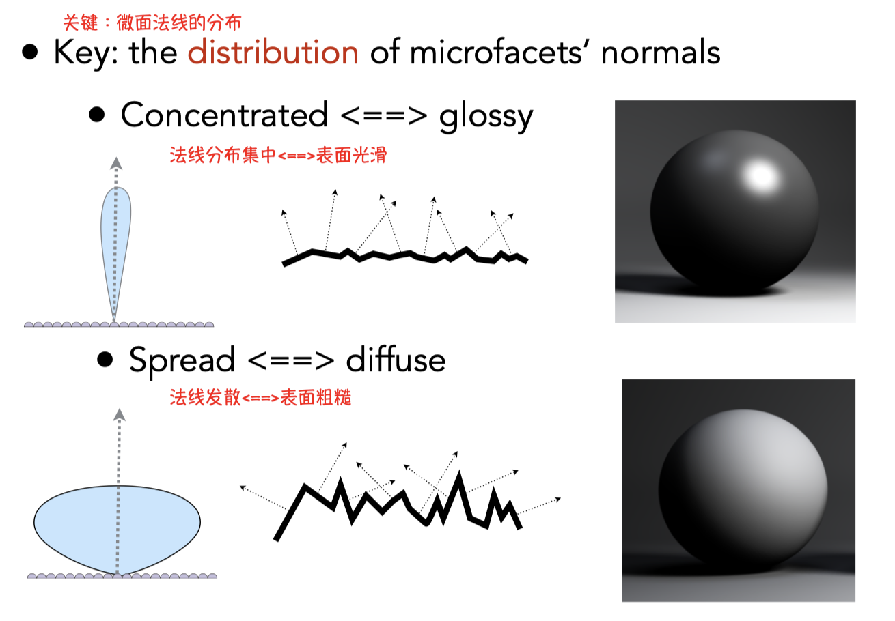

[TOC]

---

==学习思路：==

==为什么要学？==

==它是什么？==

==要怎么去使用它？==

# Leature 03: Transformation

## 0 回顾上节课的内容

- 向量
- 点乘
- 叉乘
- 矩阵

## 1 为什么要学习transform变换？

- 模型变换 model
- 视图变换 view

## 2 2D transformations

使用矩阵表示转换

### 均匀缩放、非均匀缩放

    
    
  	

 

### 反射变换

  

### 切变

  

### 旋转

- 默认围绕坐标原点，逆时针旋转

  

> 以上的几种变换都是线性变换。也就是以上的变换都可以写成一个矩阵 x 向量的形式。`x' = Mx`

## 3 齐次坐标

在进行**平移变换**的时候，变换不能以单个的矩阵形式表示，所以此时的变换不再是线性变换，而我们也不想让平移成为特例，因此想用齐次坐标将所有的变换统一地表示出来。

解决方式：通过增加一个数，将平移变成“矩阵 x 向量”的形式。用0和1来区分点和向量。（向量具有平移不变性）

- 2D 点   =  $(x, y, 1)^T$
- 2D向量 = $(x, y, 0)^T$

    
    

 

# Leature 04:  Transform (视图和投影变换)

## 投影变换

### 正交投影

### 透视投影

- 第一步：将远平面进行挤压，变成和近平面一样的大小。将这个平截头体变成和正交投影一样的长方体形状。
  - 挤压时，保证近平面永远不变
  - 且远平面的Z值、中心点都不会发生变化
- 第二步：对上述压缩后的立方体做正交投影。

如何进行挤压操作？

- 1、找到一个变换

  通过看侧面图的相似三角形，找到挤压后的坐标(x', y', z')和挤压前的坐标(x, y, z)之间的对应关系。

  

    
  

  得到：$y' = \frac{n}{z}y$         $x' = \frac{n}{z}x$    

- 2、得到变换前后的坐标关系

  那么得知**(x, y, z, 1)**应该变换为 ($\frac{n}{z}x$, $\frac{n}{y}x$, unknown, 1) 这样的坐标上，简化一下，都乘以z，结果为**(nx, ny, unknown, z)**

- 3、猜出中间的变换矩阵

  我们根据变换前和变换后的坐标，可以猜出中间的变换矩阵为

  

    
  

- 4、根据下述两条规则，推断出矩阵中第三行 z 的形式

  - 任何在近平面上的点都不会发生改变。
  - 远平面的距离，即Z值不会发生改变。

    
    
  	

 

# 补充与回顾

## 向量的叉乘

向量的叉乘：两个向量叉乘求得的结果仍然是一个向量，记为$\overrightarrow{c}$。

- $\overrightarrow{c}$垂直于$\overrightarrow{a}$和$\overrightarrow{b}$ 构成的平面。
- $\overrightarrow{c}$的方向由右手定则来决定。

1、叉乘的数学意义：
$$
\overrightarrow{a} × \overrightarrow{b} = x_1·y_2 - y_1·x_2
$$
2、叉乘的几何意义：

- |c|=|a×b|=|a||b|sinα (α为a,b向量之间的夹角)

- |c| = a,b 向量构成的平行四边形的面积

3、叉乘在图形学中的应用：

​	1）判断左和右

​				$\overrightarrow{a}$ × $\overrightarrow{b}$ > 0，那么$\overrightarrow{b} $ 在$\overrightarrow{a}$的左侧。 

​	2）判断内和外

- 如果三角形ABC的顶点逆时针排序，只要点 p 一直在三条边的左边，则表示点 p 在三角形内部。

$$
\overrightarrow{AB} × \overrightarrow{AP} > 0 ,
\overrightarrow{BC} × \overrightarrow{BP} > 0 ,
\overrightarrow{CA} × \overrightarrow{CP} > 0 → P 在三角形内部
$$

- 如果三角形顶点是顺时针排序，只要点 p 一直在三条边的右边，则也表示点 p 在三角形内部。

# ✅ Leature 05: Rasterization 1 (Triangles)

## 0 回顾上节课的内容

上节课主要说了观测变换（其中包括了视图变换和投影变换）：

- **视图变换：**利用摄像机和物体间的相对运动关系，始终把摄像机**<u>从一个任意的位置移动到一个经典的位置：在原点，看向 -z 轴，并且向上方向是 y 轴。</u>**

  然后把其他所有的物体和这个相机一样的移动。这样就可以保证把模型变换应用在所有的模型上，把所有的视图变换也应用在所有的模型上。

  在此之后，我们就知道所有的物体都是由一个标准的位置看过去，接下来就需要把物体投影成二维的照片。

- **投影变换**（将三维物体投影到二维照片上）
  
  - 正交投影：直接把深度信息忽略
  - 透视投影：可以有近大远小的效果
  
  上节课还讲了如何推导正交投影矩阵，以及透视投影如何通过先变换成正交投影，再投影过去。

观测变换完成后，我们最终得到的所有物体都会被变为在-1到1的三次方这个经典立方体里。

> 下一步是什么？（今天的学习内容）
>
> 将这些物体的照片画在屏幕上。如何画上去就是**光栅化**操作。

## 1 正交投影和透视投影之间的转换

> 透视投影转换成正交投影需要保证：
>
> a. 近和远这两个平面都是不变的。
>
> b. 近和远两个平面的大小都会变得和近平面一样大。

1）**如何定义正交投影的三维空间中的长方体？**

用它的 x 轴的覆盖，左和右；y 轴的覆盖，上和下；z 轴的覆盖，远和近。这 6 个来表示立方体。

2）**如何定义透视投影的视锥？**

正常情况下，如果我们要定义一个视锥的话，只需要：定义一个垂直的可视角度，以及定义一个宽高比。

- 宽高比：宽度/高度
- 垂直的可视角度：两条红线之间的夹角。（屏幕上下边中点与视点的连线的夹角）

  

3）可以将视锥中的这两个概念转换到之前定义的正交投影中的长方体中。

摄像机在原点，去看 -z 方向的物体。

摄像机离物体的距离是`|n|`，tan 角度是$ \frac{t}{|n|}$。

高度是 t，那么水平方向的宽度就应该是 t * 宽高比 = 宽度。

> 两者之间的概念是融会贯通的。

## 2 MVP 矩阵变换后要做什么呢？

要把在标准立方体里的三维物体画在二维屏幕上。

> 那么什么是屏幕呢？
>
> - 一个二维的数组，数组里的每个元素都是一个像素点。
> - 数组的大小，就是像素的多少，对应屏幕分辨率的大小。
> - 一种典型的光栅成像设备。
>
> 什么是光栅、光栅化呢？
>
> - Raster在德语中的意思就是屏幕。
>
> - Rasterize光栅化被定义为：将东西画在屏幕上。
>
> 什么是像素？
>
> - Pixel （picture element 的缩写）
> - 现在我们把它理解为一个个小的方块，每个方块里的颜色都是统一不变的，纯白或者纯红纯黑。也就是说像素就是最小的颜色单位了，在这个里面不会有任何的变化。（当然这是不对的，只是目前这样理解，之后会详细解释。）
> - 一个像素可以表示不同的颜色。它表示一个灰度，也就是从黑到白，可以划分成若干等级，256 个等级（0~255）0 表示它完全是黑的，255 表示它完全是白的。同时我们也可以用三个数字来表示红色、绿色、蓝色的等级，组合在一起就可以形成不同的颜色。因此一个像素可以通过 RGB 来表示。

#### 第一步：-1 到 1 的三次方的立方体到屏幕的转换。

  

- 将[-1, 1]^2^ 转换成 [0, width] x [0, height]这个空间中去。

- 视口变换矩阵：

  

    
  

- ==如何处理 z 方向上的值呢？==

#### 第二步：将一个个的三角形光栅化为不同的像素点

> 不同的光栅显示设备：
>
> - ① 示波器。多用于物理实验，显示绿色的不同曲线。
>   - 成像原理：阴极射线管 CRT（很多的电子，被加速后，穿过电场/磁场令电子束产生偏向，打在屏幕上。）
>   - 如何在电视上成像？从左到右，从上到下的画线，覆盖整个屏幕。**隔行扫描**（可了解下）
> - ② 🔺**对于现在的电脑显示器，只需要知道它们的显示原理就行。给我一个显示器，如何知道它们会显示什么？**
>   - **通过显卡中内存里的一块区域。（显卡里的内存，为显存）将显存中的某一块区域映射到屏幕上，就是现在的屏幕的显示方式。**
>   - **我们可以生成不同的图像，存在显存中的不同区域，然后告诉显示器应该显示哪一幅图。**
> - ③ 现在的主要显示设备：平板显示设备 LCD。
>   - 之前用的计算器屏幕就是一个超级低分辨率的LCD 显示设备，都可以看出一个个的像素点；现在的手机屏幕是一个非常高分辨率的显示器（LCD，OLED）；现在还有超出视网膜分辨率的显示设备，被称之为视网膜屏幕。
>   - LCD 液晶显示器工作原理：通过液晶的原理来控制一个像素到底显示什么。液晶会通过不同的排布来影响光的极化，也就是光的偏振方向。
> - ④ LED 发光二极管。要么发光要么不发光。
> - ⑤ kindle墨水屏，显示原理：有黑色和白色的墨水，通过不同的电压，可以使墨水发生翻转，也就是可以控制是黑色还是白色在上面，但是刷新率比较低，但看起来较自然。

1、为什么是三角形？

- 是最基础的多边形
  - 任何其他的多边形都可被拆成三角形
- 独特的性质
  - 三角形内部一定是平面
  - 点在三角形的内部还是外部，可以很好的被定义
  - 只要定义三角形顶点的不同属性，是可以在三角形内做一个渐变的效果。（做插值）

2、如何将一个三角形变成屏幕上的一个个像素点呢？

> 已知：经过 MVP 变换以及视口变换后，就可以知道每个三角形在屏幕上的位置坐标。

1️⃣ 判断屏幕上的像素点在这个三角形的里面还是外面。

首先需要判断屏幕上的像素和三角形的位置关系。更确切地说是判断像素的中心点和这个三角形的位置关系。

一个最简单的做光栅化的方法：采样。

> 什么是采样呢？
>
> 采样其实就是将一个函数离散化的过程。也可以理解为：给你一个连续的函数，然后计算不同的 x 所对应的函数值 y 是多少。

利用像素的中心，对屏幕空间进行采样。判断这个像素的中心点是不是在三角形内。在就是 1，不在就是 0。将最终的结果记录进对应的像素点信息中。

    
    

 

> 1、如何判断像素的中心点是不是在三角形内呢？
>
> 利用向量的叉乘来判断。（[看补充与回顾中向量的叉乘](#向量的叉乘)）
>
> 2、如果遇到一个点就在三角形的边界上如何处理？
>
> 可以自己来严格定义或者宽松处理。本课程中就认为在边上就当做在三角形内部处理。

优化处理：

那每判断一个三角形中的像素点都需要遍历屏幕上所有的像素点吗？当然没有必要，此时会用到一个叫做**包围盒(AABB)**的概念。

- 加速方法一：一个三角形其实只会覆盖一个较小的区域，其他的屏幕区域像素点无需遍历，覆盖不到。那么就可以求得三个顶点中的最大和最小坐标，得到一个三角形所在的长方形面积，只用遍历这个长方形中的像素点就可以了。

- 加速方法二：对于三角形所覆盖的区域，每一行都找它所对应的最左和最右，这样的话连一个像素都不会多考虑，相当于每一行都有一个包围盒的概念。

2️⃣ 如果像素点在三角形内，那么就在对应的像素点涂上相应的三角形颜色。  

这样，一个大概的三角形轮廓就被画在了屏幕上。

但是相应的三角形像素点被填充后，边缘会出现不光滑的锯齿现象，这种现象被称为“走样”。那么此时需要用到反走样技术。

# ✅ Leature 06: Rasterization 2 (Antialiasing and Z-Buffering)

## 1 反走样 Antialiasing

### 1.1 采样的理论

采样不止可以发生在不同的位置，还可以发生在不同的时间。

我们把一系列的图按照一定的时间放出来，就可以形成一系列的动画。这个动画就可以称为在时间中进行的采样。因为我们其实没有见过连续意义上的动画，我们看到的是所谓很连贯的视频。视频是由一帧一帧的图来组成的，一秒内依次放出 24 帧图像，让大家视觉上会认为是个连续的过程。但是其实它在每个时间点上都是离散的一幅幅图。

Sampling Artifacts：Errors / Mistakes / Inaccuracies in Computer Graphics.

#### 采样会产生不同的问题：

- 锯齿现象
- 摩尔纹 (Moire Patterns)   平时拿手机去拍屏幕，也会看到一些扭曲的纹路。
- 车轮错觉 (Wagon Wheel illusion) 车轮在高速运动的时候，人们会看到车轮在倒着转的错觉（[解释](https://www.zybang.com/question/12b2df1d89f1aa827960a87e17170fc1.html)）。因为人眼在时间中的采样跟不上轮子运动的速度，就会出现这样的现象。

产生以上问题的本质在于：信号变化的速度太快了，但是采样的速度太慢了，跟不上信号变化的速度。

#### 反走样的理念：采样之前做个模糊操作（滤波）

采样前做个模糊操作，采样的呢就是个模糊的三角形，该什么颜色对应像素就是什么颜色。解决效果还不错。

    
    

 

> 但是为什么呢？
>
> ① 为什么采样的速度跟不上信号变化的速度就会产生走样现象？
>
> [回答：通过频率来分析走样是怎么回事儿](#通过频率来分析走样是怎么回事儿)
>
> ② 为什么需要在采样之前做模糊操作？先采样后做模糊操作出来的效果就不行呢？
>
> 接下来就需要用到频域方面的知识了。

#### 频域

##### 傅里叶变换

傅里叶级数展开：任何一个周期函数，都可以把它写成**一系列正弦和余弦函数的线性组合，以及一个常数项。**（下图中的f(x)式子）

傅里叶级数展开可以描述很多不同的正弦余弦项的和。<u>**通过傅里叶级数展开我们可以知道：任何不同的函数都可以分解成不同的频率。**</u>（通过下图的右边 4 幅图就可以看出：加入的函数频率越来越高，最终的近似效果也越来越好。也意味着这个最终的图像也可以分解为这么不同的频率。）

  

我们给定一个函数，可以让它经过相当相当复杂的操作，变成另外一个函数。并且可以通过逆变换把它变回原来的函数。这就是傅里叶变换和傅里叶的逆变换。

  

傅里叶变换就是把函数给变成不同的频率的段，并且我们把这些不同频率的段给显示出来。通过傅里叶变换，我们就可以用来分析函数有着什么样的频率。

下图的五个函数有着不同的频率，从低到高，从上到下。我们用完全相同的采样方法对这些函数进行一次采样。

<u>**得出的最终结论是：**更高频率的函数需要更密的采样。</u>

  

##### 通过频率来分析走样是怎么回事儿

用同样的采样方法采样两种频率完全不同的函数，得出的结果却是完全一致，无法区分它们，这样的现象就叫做“走样”。

  

##### 滤波 = 去除某些频率内容 = 卷积（=平均）

傅里叶变换可以把函数从时域变到频域，如下图所示。

  

卷积：在周围的区域做一个平均。

    
    
    

 

时域上，如果想对两个信号进行卷积。其实对应到两个信号各自的频域上，是两个信号的频域的乘积。所以卷积操作和乘积操作是挺接近的。

> **卷积定理：**函数的卷积的傅里叶变换是函数傅里叶变换的乘积。卷积定理揭示了时间域与频率域的对应关系。
>
> - 时域卷积定理：时域内的卷积对于频域内的乘积
>   - 两信号在时域的卷积积分 = 在频域中该两信号的傅里叶变换的乘积
> - 频域卷积定理：频域内的卷积对应时域内的乘积
>   - 两信号在时域的乘积 = 这两个信号傅里叶变换的卷积除以 2π

通过卷积定理，我们就知道如何做一个卷积：

- 可以直接拿到一幅图，直接用卷积的滤波器去做一个卷积操作。
- 也可以把这张图
  - 先做一个傅里叶变换，变到频域上；
  - 后把卷积的滤波器也变到频域上；
  - 两者相乘，得到频域的结果；
  - 然后再将结果傅里叶逆变换为时域上。

##### 采样 = 重复频率内容

假如说我要采样第一个函数a，那就是需要把这个函数变成一系列离散的点，只留下在某些位置上函数的值。这就好像在这个函数上乘以另外一个函数，比如第二个函数c，它只在某些地方上有值，其他地方值为 0。最终相乘的结果就是第三个函数e。

  

如何做采样呢？

给一个原始的信号，去乘上第二个这样的函数，就可以得到第三个函数，就是采样的结果。

这是在时域上，如果在频域上呢？已知时域上的乘积对应的就是频域上的卷积。

那么就是b卷积d 得到的结果为 f。

**<u>从f 图可以总结出：采样是什么？采样就是在重复原始信号的频谱。</u>**

我们就可以理解了“为什么会产生走样现象”这个问题：

因为采样不同的间隔会引起频谱以另外一个不同的间隔移动。走样在频域的角度上来说，就是频谱在搬移的情况下发生了混叠。**如下图所示**：

  

### 1.2 实际的图形学中如何做反走样

#### 方法一：增加采样率

这是一个终极解决方法。但是代价昂贵且可能需要非常高分辨率。

#### 方法二：反走样

先模糊，后采样。也就是先把原始的高频信号拿掉，后采样。原理如下：

  

##### 模糊操作

那我们如何进行滤波操作？也就是如何进行模糊处理呢？

先模糊操作，也就是卷积操作，求个平均。

我们期望做到的：通过计算平均像素值进行抗锯齿。在栅格化一个三角形时，函数f(x，y) = inside(triangle，x，y) 的像素区域内的平均值等于该三角形覆盖的像素的面积。

  

###### MSAA

用更多的采样点来反走样。MSAA是上述期望做法的一种近似操作。毕竟算出三角形覆盖每一个像素的面积大小是需要很大计算量的。

MSAA 的思想：认为一个像素内被划分为好多小的像素。假设被划分为 4 x 4 = 16个小像素。每个小的像素假设有个中心，然后判断这些点是否在三角形内，将最终得到的结果平均起来。这个平均后的结果就可被看做三角形对这个像素点覆盖区域的近似。

    
    
    

 

MSAA 做的是模糊操作。它绝不是靠提升频率分辨率来增加效果，只是靠增加采样点来更好地近似三角形的覆盖率而已。

> MSAA 为增加效果付出的代价？
>
> 增加了计算量。一个像素被划分为 4 x 4，那么就是多了 16 倍的计算量。
>
> 为了解决这个弊端，后续人们会用更加有效的图案来分布采样点，而且这些采样点有的还会被邻近的复用。

##### 采样操作

采样就很简单，此时一整个像素格子就是一个颜色，直接采样在模糊操作完之后的像素点中心取这个颜色就好。

>小结：
>
>1、很重要的另外两种抗锯齿方法
>
>- FXAA 快速近似抗锯齿。和增加样本数没有任何关系，它是一个图像的后期处理。原理：通过图像匹配的方式找到有锯齿的地方，然后把这些有锯齿的边界给替换成平滑的边界。
>- TAA 简单高效，与时间相关。原理是复用上一帧的信息。
>
>2、超分辨率/超采样
>
>- 从低分辨率到高分辨率。把小图变成大图，又不想看到锯齿现象。
>- 基本上还是“样本不足”的问题
>- DLSS（深度学习超级采样）

## 2 可见性与遮挡

### 2.1 画家算法

#### 原理

先对远处的物体进行光栅化，后逐步对近处的物体进行光删化操作。（画近处的物体时会覆盖掉之前画的远处的一些物体）这样就可以正确地处理遮挡的问题了。

#### 涉及到一个问题

这里涉及到一个问题：当某些物体在深度上存在互相遮挡的情况，此时没有办法定义顺序关系，这样就无法使用画家算法，因为不知道应该按照什么样的顺序画，或者不管先画什么都是错的。如下图所示：

  

### 2.2 问题解决方法：深度缓存/缓冲 z-buffer

思想：在生成最终图像的同时，也会生成一个“只存像素所看到的几何物体最浅的深度信息”的图像。然后利用深度缓存来维护遮挡信息。

- 每一个像素内存储最浅深度值，即 z 值。

- 需要额外的深度值缓冲区
  - 帧缓冲区（frame buffer）存储颜色值
  - 深度缓冲区（z缓冲区）存储深度

  

> 之前的讲述是摄像机永远看向z轴的负方向，因此所有的 z 都是负的。以为这 z 值越大距离反而越近，z 值越小，离摄像机的距离越远。
>
> 为了简化计算，将之前看到的 z 换一个概念。***<u>我们现在认为，摄像机到物体之间的距离，也就是深度信息，这个值永远都是正的。越小的值表示越近，值越大表示距离越远。</u>***

深度缓存算法思想：

- 一开始将所有像素记录的深度缓存距离都初始化为无限远，即初始化为无限大的值。
- 在光栅化的过程中，找到任意一个三角形所覆盖的任意一个像素。
- 如果新的三角形要画在这个像素内，对于这个像素来说，如果新的 z 值比之前所存储的深度信息还要小，那么就将像素点的颜色值和深度信息值都进行更新。否则，什么都不做。

注意这里并未进行排序，只是在不断求最小值而已。复杂度为O(n)。

**<u>该算法有一个很重要的特点：和绘制顺序是没有关系的，只要正确求得最小的深度信息，最后绘制出来的图像就是对的。</u>**（前提条件，不出现在同一个像素点上出现相同的深度信息的情况。）

> 总结：
>
> 这是一个非常非常重要的算法，几乎广泛应用在所有的硬件中。每一个像素维护一个深度测试，就可以得到正确的遮挡算法。
>
> 之前有提到过 MSAA 的方法，对于这里面的采样点进行深度缓冲的话。意味着也不一定是对每一个像素进行 z-buffer, 也有可能是对采样点~
>
> z-buffer 一定处理不了透明物体的深度，这个需要特殊处理。

绘制透明物体

> 缓冲区其实就是一张和最终输出图像分辨率一样大的图，每个像素存储了不同的数据。
>
> 1）深度缓冲区 z-buffer：每个像素记录了离相机最近的片元的深度。
>
> 2）颜色缓冲区 Frame buffer：也叫帧缓冲区，每个像素记录了当前该位置对应的颜色。

1、场景中存在半透明物体的正确渲染

​		由于通过透明物体是可以看到被其遮挡的物体的，因此对于深度缓存中的深度值就不能直接替换更新，深度值应该是离相机最近的不透明物对应的片元的深度值，否则就会出现透明物体挡住不透明物体的渲染错误。
​		因此在渲染半透明物体时，需要关闭深度写入，但要保留深度测试。（深度测试的目的在于判断：是否因为遮挡而舍弃当前片元，如果该透明片元在不透明物体后，它被遮挡了，深度值比较大，当然应该被丢弃。当它在不透明物体前，它就不会被丢弃，但是又不会将当前的深度值写入，还是会以不透明物体的深度信息为准。）

​		同时对于颜色也不可以和以前一样替换更新，而是要做透明度混合，即用帧缓存中已有的颜色和透明片元的透明色混合出一个新的颜色。

**场景总存在透明物体时的渲染步骤：**

- 先渲染不透明物体，后渲染透明物体

- 对透明物体进行排序，然后从远到进的顺序依次渲染。（因为只有这样才能正确地叠上，并混合出正确的颜色）

- 并开启它们的深度测试，但关闭深度写入。

  

>但此时还存在两个问题：
>
>1）仍然无法解决透明物体相互交叠的问题。
>
>2）透明物体内部如果自身互相交叠也会存在问题。无法判断片元的先后顺序。

2、半透明物体间相互交叠的问题

3、半透明物体的自身交叠问题及双面渲染

关闭背面剔除，将双面渲染的工作分成两个pass，渲染两次：

- 第一个pass只渲染背面
- 第二个pass只渲染正面

保证背面总是在正面被渲染之前渲染，从而可以保证正确的深度渲染关系

# ✅ Lecture 07: Shading 1 (lllumination, Shading and Graphics Pipeline)

当这些物体都变成三角形之后，变成屏幕上的一个个像素点之后，这些像素的值和颜色应该是什么呢？这个就是着色的功能。下一步操作为着色。

挪动一下光源后，物体并没有发生变化，但是物体的颜色却发生了变化。这个问题应该如何解决，就是着色的作用。

这门课中着色的定义：对不同的物体应用不同的材质这样一个过程。

因为不同的材质肯定和光线的相互作用有不同的方法，可通过这种不同的表现形式来展示材质的特性。

## 1 照明和阴影

### 最基础的模型：Blinn-Phong反射模型

> Blinn-Phong 模型是一个经验模型，并不是一个完全符合物理规律的模型。
>
> (下图的所有向量都是指的单位向量。)

- 镜面高光 Specular：一束光打到比较光滑的表面上，这束光就会在这镜面反射的附近被反射出去。
- 漫反射光 Diffuse：一束光打到比较粗糙的平面上，光会向四面八方反射出去。
- 环境光 Ambient：并不是一种直接光照，是间接光照。通过四面八方的物体反射得到的光。

我们此处考虑的这个 shading point，就只考虑这个点和其他的几个不同的方向，不考虑这个点是否在阴影内。考虑这个点的着色情况就只看它自己，不考虑其他物体的存在。

着色有局部性。着色可以看到物体的明暗变化，但是看不到阴影。==阴影如何生成稍后再讲~==

#### 漫反射

- 知道了有多少能量会被传播到当前的 shading point

  > 光线在传播的过程中，在单位面积的情况下，在任何一个位置上所能接收到的能量和光线传播的距离是成平方反比的。（也就是，光线传播的距离越长，单位面积上所接收到的能量是逐步衰减的。）

- 也知道了有多少能量在这个 shading point 上会被吸收

  > Lambert 余弦定律
  >
  > “接收到的能量”和“光照方向与法线方向之间夹角的余弦”是成正比的。

将以上两者结合到一起，就可以知道 diffuse 的表示方法了。

  

shading point 到点光源的距离为 r；点光源到单位距离上的能量强度是 I，那么我们就能够知道这个点光源通过 r 这个距离传播到shading point的能量有多少。能量到达了物体之后会被物体表面吸收，而吸收多少取决于Lambert 余弦定理。最终计算的结果$L_d$就表示我们可以看到有多少能量，对应的就是物体的明暗。

有一个地方需要注意的是，$ max(0, n · I) $ 这里为什么要做一个点乘？表示的是当点乘结果是负值的时候，表示光从下面打过来才可能出现，此时并没有什么物理意义，就把值取为 0。

shading point 为什么会有颜色？因为它自己本身会吸收一部分能量，反射出去的是它不吸收的能量。由于不同的点对能量有不同的吸收率，定义一个系数$K_d$  来表示这个点本身吸收多少。（当$K_d = 1$  意味着不吸收任何能量，$K_d = 0$  意味着吸收了所有的能量，我们看到的是个黑的。）不同的漫反射系数$K_d$ 决定了它的亮度和颜色。

漫反射光打到shading point 上去，会被**均匀地反射**到各个方向上去，就意味着我们不管从哪个方向上观察这个点，所看到的结果应该是一样的。(因为能量是被均匀反射出去的。) 最终看到的结果和 v (观察方向)完全没有关系。

#### 高光

什么情况下看得到高光？比较光滑的物体的反射都具有一定的特性，反射方向非常接近镜面反射的方向。**<u>当观察的方向和镜面反射方向接近的时候，就能看到高光了，</u>**其他时候看不到高光。

    
    

 

v 和 R 接近，就说明了 h 和 n 接近。它们两个有一定关系。可通过衡量 n 和 h 是否接近来判断我们是否可以看到高光。如何衡量两个向量是否接近呢？点乘。两个向量很接近的话，那么点乘结果接近 1，离得很远的话，点乘结果接近 0。 

  

多少能量到达了shading point 还是和上面一样考虑。但是没有考虑有多少能量被吸收了，因为它毕竟还是一个经验模型，它在这里没有考虑这部分。

> 为什么要用半程向量和法线来近似 R 和 v 是否接近呢（这个是 blinn-Phong 模型）？为什么不直接计算 r 和 v 的夹角是否接近（这个就是 phong 模型。 ）？这是一个改进，因为反射向量 R 不好计算。近似可以简化很多的计算量。

#### 环境光

环境光来自四面八方，强度都是相同的。这里的环境光其实是一个常数。它的作用就是保证物体并非完全是黑的。（环境光是间接光照，计算起来十分复杂，这里用一个合理的常数来近似代替实际的环境光。）

#### 最终的Blinn-Phong 模型

  

下一步就是对所有的像素点做一个着色操作。

### 着色频率

着色频率指着色要应用在哪些点上。

三种着色模型：

- Flat shading
  - 每一个三角形是一个平面，对每个三角形的面求出一条法线。（对三角形的两个边做个叉乘即可求得）
  - 不适用于光滑表面。
- Gouraud shading
  - 对每个三角形的每个顶点求各自法线，求得之后做一次着色，那么每个顶点就有颜色了，三角形内部的颜色就可通过插值计算出来。
  - 如何对顶点求法线？[答案在这里~](#如何知道逐顶点的法线是什么？)

- Phong shading
  - 对每个三角形的每个顶点求各自法线后，可以对三角形内部的每个像素都插值出一个独特的法线方向。对每个像素进行一次着色，就可以得到一个相对比较好的结果。
  - 区分一个概念，之前的是Phong着色模型，这个是指的**着色频率**，是不一样的。

    
    
  	

 

由下图可以看出，当模型足够复杂时，其实可使用相对简单的着色模型，因为效果差不多。这时用更小的开销，得到近乎一样的效果。**<u>因此着色频率取决于面、点出现的频率，当面出现的频率已经很高的时候，就可以用相对简单的着色模型。</u>** 

  

#### 如何知道逐顶点的法线是什么？

理想情况：知道它近似的是什么形状，因此直接求得法线。比如近似的是球，那么直接连接这个点和球心就好了，延长线就是该点的法线。

很多三角形往往会共用一个顶点，那么这个顶点的法线可以认为是这相邻所有面的法线的平均。做**加权的**平均，相邻三角形面积越大认为它对顶点法线的贡献的越大。

> 又如何真正地去定义一个逐像素的法线呢？
>
> 已知两顶点的法线，如何插值出中间的法线呢？==这个就需要用到重心坐标。(稍后会讲到。)==

# ✅ Lecture 08: Shading 2 (Shading, Pipeline and Texture Mapping)

## 2 实时渲染管线

### 管线概述

先把三维空间中的点投影到二维空间中去，然后再指定每哪三个点可以组成一个三角形。三角形会覆盖屏幕上的哪几个像素点（光栅化 ），对这些像素点进行着色。

    
    
    
  	
  	
  	

 

### 着色器

着色器shader 是用来定义任意的顶点，怎样操作任意的像素或者片段。

>  网站推荐，只用关注场景如何渲染
>
> Inigo Quilez   http://shadertoy.com/view/ld3Gz2

### GPU

用于执行图形管线计算的专用处理器。

GPU 本身是一个高度并行化的处理器。

  

## 3 纹理映射

我们希望在物体不同的位置定义不同的属性，因此引入了纹理映射。

如何定义任何一个点的不同属性呢？

首先意识到：任何一个三维物体，其实它的表面都是二维的。而纹理就是一张图。

纹理映射就是将这张图按照，物体上的一个点和纹理上的一个点的一一对应关系，给它包围在物体上。三角形每个顶点都对应一个纹理坐标。

> 任意一个三角形都能找到在纹理上它应该在哪个点上。
>
> 如何找到对应的解决方法：（了解一下即可）
>
> - 美工完成的。
> - 自动化过程，给你任何一个模型，可以将它展开成一个平面，并且尽量避免三角形的扭曲。将它和纹理一一对应。（这是一个几何上的重要研究方向~）

针对纹理定义了一个坐标系，可以指出纹理上任意一个点的坐标(u, v)。 注意：u 和 v 都在[0, 1]这个范围内。

纹理可被重复使用多次。

# ✅ Lecture 09: Shading 3 (Texture Mapping Cont)

- 重心坐标，为了做插值
- 纹理如何贴在物体表面
- 纹理的其他应用

## 3.1 如何在三角形内部进行属性的插值？

### 3.1.1 重心坐标

为什么要在三角形内部做插值？

- 当我知道三角形三个顶点的属性的时候，我们希望通过此知道三角形内部的一些值。并且插值可以做到平滑的过渡。

插值什么内容？

- 可以在三角形顶点上定义各种不同的属性，可以通过插值此知道三角形内部点的属性。这些属性可以是位置，纹理坐标，颜色，法线，深度，材质等。

如何做插值？

- 通过重心坐标。

#### 什么是重心坐标？

重心坐标是定义在一个三角形上的。在三角形 ABC 所形成的平面内的任意一点(x, y) 可以表示成三个顶点坐标的线性组合。注意！需要满足一个条件：线性组合的三个系数加起来等于 1。**这三个系数的组合就是点(x, y)在该三角形的重心坐标下的表示。**

  

由于“系数加起来等于 1”这个条件的限制，因此重心坐标虽说是三个数，但只要知道两个数的话，就可以 1-这两个数的和，求得第三个数了。这样其实也是有道理的，毕竟我这是个二维平面，本来只用两个数就可以表示坐标了，不用非得三个数。

**如果这个点在三角形内，还需要满足另一个条件：这三个系数都是非负的。当这个条件满足的时候，我们就知道这个点一定在三角形内。如**果不满足这个条件，但满足三个系数和为 1 的话，那么表示这个点在三角形所在平面，但有可能在三角形外。

从定义，我们也可以知道△ABC 所在三个顶点的重心坐标：A(1, 0, 0)、B(0, 1, 0)、C(0, 0, 1)。

#### 如何求得三个系数，也就是如何求得重心坐标呢？

##### 方法一：面积比

**三角形内的点将三角形划分成了三个区域，利用这三个区域的面积比求得对应的三个系数。**顶点 A 对面的三角形区域被称为$A_A$，顶点 B 对面的三角形区域被称为$A_B$，顶点 C 对面的三角形区域被称为$A_C$。如下图左。

三角形的重心有个特殊的性质，可以将三角形 ABC 分成面积相等的三部分。因此三角形重心的重心坐标是($\frac{1}{3}$, $\frac{1}{3}$, $\frac{1}{3}$)。

##### 方法二：公式法

已知三角形的三个顶点坐标，就可以用公式求得这三个系数是多少。如下图右。

    
    

 

我们只要知道：对于三角形内任意一个点，都可以计算它的重心坐标就可以啦。

### 3.1.2 求得重心坐标后，如何用它进行插值呢？

求得了重心坐标后，就可以用重心坐标去计算三角形内部任意一个点的额插值。**我要插值的属性同样也能用重心坐标去把它用线性组合表示出来。** 意思是：假如三角形顶点有多个属性，那么我就可以通过三角形内部的一个点，它的重心坐标 (α, β, γ)，将它的属性通过这个坐标给线性组合起来，得到该点的属性值。

**<u>*总结：先算出重心坐标，然后用重心坐标和三角形顶点的属性信息做一次线性组合，得到我们想要的三角形内部点的属性信息。*</u>**

但是请注意❗️在投影下，这个三角形的形状可能会发生变化，因此也是不能保证重心坐标不变的。总结：经过投影后，三角形的重心坐标有可能会发生改变。

因此，如果我们要插值三维空间中的属性，就应该取三维空间中的ABC坐标来算它的重心坐标是多少 ，再去做插值。不能在投影之后的坐标里面做插值。

> 特别说一下深度。光栅化的时候，三角形都被投影到屏幕上去了，三角形会覆盖很多的像素，像素都有中心。对这些中心点可以知道它在投影了的三角形的哪里，然后求出重心坐标，对投影了的三角形顶点的深度做插值。**<u>这个操作方式得出的结果是不对的。</u>**
>
> 正确操作姿势：找到像素中心点对应在三角形的位置它在三维空间中的坐标。然后在三维空间中对三角形顶点的深度做插值。（应用逆变换将已经投影到二维平面上的三角形再投影回去。）
>
> 在三维空间中的属性就在三维空间中做插值，然后再把它对应到二维空间中去。
>
> 根本原因就是：重心坐标在投影操作下可能会发生变化。

## 3.2 如何将纹理应用在实际的渲染中？

每个三角形顶点都会对应一个纹理坐标(u, v)，那么三角形内部的采样点就可以通过重心坐标插值来求得采样点自己对应的纹理坐标属性。然后再根据这个纹理坐标查看纹理图上该坐标对应的颜色，最后将这个颜色给涂在相应的采样点上。

### 3.2.1 纹理的放大（纹理太小了怎么办？）

看着很高清的一个墙，上面贴的图却很低清，这种情况怎么办呢？

#### 纹理过小导致的问题描述

对于任何一个采样点，都可以找到它对应的纹理位置。但是这个位置可能不是整数，不是整数怎么办呢？就把它四舍五入为整数。那么在一定的范围内，我们要查找的是相同的纹理上的像素。

> 纹理上的像素，叫做纹理元素，或者纹素texel。

**会出现一种现象：一个像素的周围很多像素都会被映射到同一个纹素上。这就是因为纹理太小了。**这样的图片会看起来有一个个格子，效果并不是很平滑自然。

这就引出需要解决的一个问题：那当我们查到的纹理坐标是非整数的时候，应该如何处理呢？往下看解决方法：

#### 双线性插值

首先利用水平的两个顶点的颜色，进行水平插值得到$u_1$和$u_2$的颜色值；然后利用$u_1$和$u_2$的颜色值进行竖直方向上的插值得到我们想要的红色点的颜色。

最终红色点所对应的颜色就综合考虑了周围四个点的颜色，可以在四个点所围成的区域内，取得一个平滑的颜色。

找最近的四个点做双线性插值就可以得到平滑过渡的结果。

  

#### 双向三次的插值

不是取周围的 4 个纹素，而是取的 16 个。然后也是先做多次水平上的插值和垂直方向上的线性插值。

这种做法的运算量比双线性插值的要大很多，但是效果也会好很多。

###  3.2.2 如果纹理太大了怎么办？

#### 纹理太大导致的问题描述

  

近处出现锯齿现象，远处出现摩尔纹。

近处一个像素覆盖的纹理区域其实相对较小；在远处，一个像素其实覆盖的是一片纹理，是比较大的区域。这告诉我们：**屏幕上的像素覆盖的纹理上的区域大小是各不相同的。**

如果说对于一个像素，它覆盖的纹理区域挺小，用这个像素的中心计算到的纹理坐标查询一下它的值。得到这个像素区域所覆盖纹理的值，可以近似的这样认为没问题。

但是当一个像素覆盖的是一片很大的纹理区域，它使用点采样所对应到的颜色值就可以代表这个纹理区域的平均颜色值吗？当然不可以，一个像素点是不能对应这么大一块纹理的，纹理中都有不同的颜色变化啊。因此当一个像素点对应的是比较大的一块纹理区域的时候就不能使用点采样。

  

**<u>本质原因：当这个纹理特别大的时候，一个像素里面有可能包含特别大一块纹理。这块纹理一直是在变化的，也就是说这个像素内部频率变化很高，可是你只用了一个采样点（像素）去采样它，这样效果肯定不对。</u>**应该需要一个更高频的采样方法。

#### 解决方法一：超采样

将每个像素分成 512 个采样点，然后把每个采样点在纹理上对应的位置都计算出来。效果肯定特别好，但是计算量和花销也是相当大的。

#### 解决方法二：Mipmap

提供另一个完全不一样的思路。避免采样，立刻就可以知道一个像素对应的这个纹理区域中的平均值是多少。

mipmap 允许做快速的、近似的、正方形的范围查询。

##### 什么叫mipmap?

从一张图生成一系列图，每一张图都是上一张图缩小到一半。因此一共可以生成$log_2 N$层。如下图，当原始图是128x128大小的时候，可以生成7层mipmap。

  

在渲染之前，将这些对应的 mipmap 都生成好存储起来。因此使用 mipmap 会占用更多的存储量，但只是多出了原始图片存储量的三分之一。

> 用 mipmap 做一个近似的在一个正方形区域内做范围查询，要立刻得到这个区域内的平均值。

##### 如何知道要查询的正方形区域有多大？

**有一个近似正方形区域的方法：通过使用屏幕上的相邻采样点的纹理坐标，计算纹理坐标之间的距离，将较大的距离作为正方形的边长，用这个正方形来近似该采样点的纹理区域。**具体理解如下：

当一个三角形覆盖了一堆采样点，可以取采样点自己的中心和采样点邻居的中心，分别投影到纹理上去。

将采样点上面和右边的点投影到纹理上，然后分别计算，在纹理空间中，采样点到采样点上面和右边的距离。当然这两个距离会有所不同，简单起见，就取较大的距离值来近似正方形的边长。这个正方形的面积对应的就是像素点投影在纹理上的面积大小。

    
    

 

##### 如何用mipmap来查询正方形区域的平均值？

重要的是：当我们将像素点覆盖的纹理区域近似成一个正方形之后，如何根据之前预计算好的mipmap，来查询这个边长是L的正方形区域的值的平均值是多少？

如果这个区域的大小就是1x1 一个像素，那就可以在没有做mipmap的最原始的那张纹理上找对应的像素就是它的值。如果这个区域的大小是4x4，那么第1层就是2x2，这个区域到了第2层上就一定会变成1个像素。查询第2层的像素，就可以知道4x4所对应的一个像素颜色是多少。

**总结：L x L这个大小的区域，到了第 $log_2 L$ 层就一定会对应到一个像素上去。直接去查这一层的像素，就可以立刻得出L x L这个区域的平均值是多少。**

每个像素都会投影到纹理上，计算这个像素对应多大区域，然后确定应该去第几层去找这个平均值。

##### 用三线形插值（正方形）来平滑过渡层与层之间

下图做了一个可视化。离屏幕比较近就会看到很多细节，应该在较低层去找，离屏幕比较远的话，应该去较高层查询颜色的平均值。但是从图中可以看出，颜色之间的衔接处比较生硬，我们所期望的应该是一个渐变的颜色，得到平滑的过度，这里就可以采用插值的方式。

    
    

 

有第1层和第2层，想查询第1.8层的值。做法：对第1层和第2层的内部，分别做双线性插值。接着将插值后的两个结果放在一起，在层与层之间再做一次线性插值。这样不管是整数还是浮点数层，就可以通过“三线性插值”的方式，只做查询一次，得到它覆盖的纹理区域面积颜色的平均值。

三线性插值的应用十分十分广泛，因为它可以得到一个完全连续的表达。它本身的开销挺小的，就是做两次查询和一次插值。

  

#### 各向异性过滤 Ripmap（矩形区域）

用mipmap是否能完全解决问题？

并不能。对于远处会有过度模糊的问题。

各向异性过滤的效果会比三线性插值要好。比mipmap多了不均匀的水平和竖直方向上的压缩。

屏幕上的像素映射到纹理上，不一定都是一个规律的形状，很有可能会出现一些不规则的，斜着的形状。如果还用之前的正方形来近似这样的不规则形状就会十分不准确，会造成过度模糊的问题。

引入了各向异性过滤后，对于这种长条状的图形，会得到一个几乎完美的解决。各向异性过滤允许我们对这样的长条形区域做一个快速的范围查询，这样就不用限制在只能用正方形来近似纹理区域。

但是各向异性过滤其实只解决了一部分问题，对于矩形的查询是可以的，比正方形的mipmap查询效果要好很多。但是对于斜着的这种区域没有办法。

  

#### EWA过滤（不规则形状，椭圆）

假设你有任意的一个不规则的形状，可以把不规则的形状给拆成很多不同的圆形去覆盖这个不规则的形状。

这个椭圆，可以拆成3个不同形状的圆形去覆盖它。多次查询，自然就可以找到覆盖这样的不规则形状的椭圆。

代价就是多次查询。质量越好，代价越大。

  

整体思路：先算出mipmap等级，然后算出椭圆系数，最后根据椭圆系数确定椭圆的包围盒。对于包围盒内的纹素进行遍历并作加权平均，得出结果。

# ✅ Lecture 10: Geometry 1(Introduction)

## 上节课的回顾

Shading 1 & 2

- Blinn-Phong模型
- 在什么地方做着色？着色频率：对三角形做着色、对三角形顶点做着色、对像素做着色。
- 计算机的硬件如何做着色？shader、GPU
- 着重说了一下纹理映射，用纹理来定义逐点的一些属性。

Shading 3

- 如何做插值？如果定义了三角形的顶点属性，如何使用重心坐标去插值计算出三角形内部的采样点的属性。
- 纹理贴在表面上出现的两种情况：
  - 纹理过小怎么办
  - 纹理过大怎么办？mipmap
- 纹理的应用（今天的课程内容之一）

## 3.2.3 纹理的应用

### 概述

之前说过纹理就是一张图。由于mipmap的广泛应用，在现在的硬件已经都支持mipmap了。我们可以将纹理理解成一块内存，在内存上的区域进行范围查询，或者滤波操作。= 有一块内存区域可以做点查询，或者范围查询，可以做得非常快。

**总结理解：纹理就是一块数据，可以做不同类型的查询。**（不用将它限制在一个图像上。）

### 1）环境光贴图

站在房间里，来自四面八方任何一个方向都会有光，拿一张图来记录下来这个光（不区分是直接光还是反射光），就是环境光贴图。

用纹理图去描述环境光，从而用环境光去渲染其他的物体。==（如何渲染后续再讲～）==

- 犹他茶壶 —— 被广泛应用的经典模型
- 用纹理来描述环境光的时候，有一个假设：环境光都是来自无限远处。只记录方向信息，认为无限远，没有什么实际的深度意义。

  

#### Spherical Map

将不同的环境光记录在球面上，然后把球面展开。

但是这样会出现很大程度上的扭曲问题。虽然确实用球面记录下来了，但这并不是一个均匀的描述。（那么如何解决呢？Cube Map）

#### Cube Map

认为球有一个包围盒，用正方体将球包住。不再是把光照信息存在球的表面，而是存在立方体的表面。将环境光记录在立方体的6个表面，并且将这6个面一一展开。

- 优点：没有扭曲的现象发生，各个面都是均匀的且记录完整。

- 缺点：给定一个方向，如果想知道这个方向的光照是多少，原本可以在球上很容易的求出来。

  但是现在给你任何一个方向，得先判断这个方向被记录在立方体的哪一个面上了。因为这是一个一一对应关系，任何一个方向，你总能找到这个立方体的某一个面，记录了这个方向。当然需要一些额外的计算，但是非常快。

    
    

 

> 小结：不管是用球面还是正方体来记录周围的环境光，它们本质都是记录来自不同方向的光照信息。

### 2）凹凸贴图

纹理不一定只能用于描述颜色，之前用纹理是为了替换Blinn-Phong模型中的$k_d$这一项，为了替换其中漫反射的颜色。**除了描述颜色外，纹理还可以用于定义任何位置的任何不同属性，比如可以定义任意一个点它的相对高度是多少。**

几何模型上三角形的顶点也都是有对应的纹理坐标，可以计算出三角形内部任意一个点对应的纹理坐标，再在纹理上查找对应点的相对高度信息。

#### 基本原理

意思是：可以**在不将几何形体变复杂的情况下**，通过应用一个复杂的纹理，从而定义任何一个点的相对高度。相对的高度一变，法线就会发生变化，着色的结果也会跟着发生变化。

而人们看到不同的明暗对比，一定程度上就是因为法线发生变化，然后产生了着色上的明暗对比，我们就认为这里有凹凸的东西。

我们用凹凸贴图这种办法，其实我们是在试图人为地做个“假的”法线出来，然后在任何一个点都可以通过纹理映射求出一个假的法线，利用这个假的法线可以给一个假的着色结果，从而欺骗人的眼睛，让人觉得有凹凸的效果，但实际上我们并没有改变这个几何。

> 法线贴图和凹凸贴图本质上是一样的，取决于纹理本身定义的是什么。
>
> 法线贴图和凹凸贴图一定程度上就是为了改变任何一个点的法线。

#### 操作步骤

明确一点：凹凸贴图是在不改变物体的几何信息，也就是不增加三角形的情况下，为物体的表面添加更多的细节信息。

##### 把任何一个像素的法线做“扰动”

如何扰动呢？通过定义不同位置的高度，它临近的这个位置的高度差来重新计算它的法线。就是说我们这个纹理定义的是任何一个点的相对高度的移动，通过高度的变化来改变法线。

  

##### 计算变换后的法线

如何计算法线应当如何变化呢？有下面两种情况，分别分析如何计算：

1）in flatland

我们先把这个问题简单化，不考虑二维的贴图、三维的空间。我们考虑变化的一维函数，叫做flatland case。

  

- 原本的点p的法线：n(p) = (0, 1)
  - 原本这个几何是平面，那么法线是垂直向上的，为 (0, 1)。
- 求得现在该点p的切线：p的导数为 $dp = c * [h(p+1) - h(p)]$
  - 如果定义了一个凹凸贴图，需要计算在任何一个点处凹凸贴图给出的它的梯度，或者说它的这个函数的导数。也就是说，这条曲线上的任何一个点的切线应当如何计算：用相邻两个点的高度差，除以间隔1。$[h(p+1) - h(p)]/1$
  - 引入一个常数$c$用来定义这个凹凸贴图影响到底大不大，这就是做一个简单的缩放而已。
- 求得扰动法线：$n(p)=(-dp，1).normalized()$
  - 法线和切线是垂直的，直接将切线旋转 90 度就可以得到法线。
  - 最后记得标准化。

2）in 3D

- 原始表面法线: $n(p) =(0, 0, 1)$
- p的导数为：(对u和v两个方向上分别求导数)
  - $dp/du = c1 * [h(u+1) - h(u)]$
  - $dp/dv = c2 * [h(v+1) - h(v)]$
- 扰动法线是: $ n = (-dp/du, -dp/dv, 1).normalized()$
- 注意：假设**在局部坐标系中**，认为这个法线坐标一直是 (0, 0, 1)

> 通过纹理映射的方式，在每个点上都定义一个假的法线，改变之前的法线的方向，然后将换了的法线方向，重新计算回世界坐标里。

### 3）位移贴图

Displacement mapping，一种更先进的表示方法。

- 使用了与凹凸贴图完全相同的纹理，都是用纹理定义一个点的相对高度。
- 但位移贴图会把三角形的顶点位置真的移动。
- 效果会比凹凸贴图更好。代价是：要求模型本身的模型三角形比较细。三角形顶点之间的间隔大小得跟得上纹理变化的速度。

### 4）其他的纹理应用

- 3D程序噪声实体建模
- 提供预先计算的阴影
- 3D纹理和体积渲染

---

## 1 几何的介绍

### 1.1 介绍具体的几何例子

- 车子
- 衣服布料
- 水滴
- 城市远景、建筑群
- 细胞、蛋白质等微观几何

### 1.2 不同的几何表示方法

#### 1）隐式几何

只表述点之间满足的关系，不指定实际具体的点到底在哪儿。

定义一个更通用的情况，定义一个函数 $f(x,y,z) = 0$ ，只要有 x,y,z 满足这个函数关系，那么就认为在(x,y,z)位置的这个点在刚刚表述的平面上，

优点：可以很方便地判断点是否在表述的平面上，或者内，或者外。

缺点：采样困难；不知道函数表示的面长什么样，并不直观。

#### 2）显式几何

所有点都直接给出，或通过参数映射给出。

参数映射：定义一个函数，给的值是(u,v)，输出的是(x,y,z)。

优点：采样简单，函数表示的几何形状是什么样很直观。

缺点：难以判断指定点是在表述的平面上，还是里面，还是外面。

#### 1.2.1 隐式几何的其他表示方法

几何的隐式表示可以不止是通过代数方法来描述。

##### 1）Constructive Solid Geometry, CSG

通过一系列基本几何的基本运算，来定义新的几何。

  

##### 2）Distance Function, 距离函数

对于任何一个几何，都不去直接描述它的表面，而是描述**<u>空间中任何一个点到物体几何表面上的任何一个点的最近距离</u>**。（这个距离可正可负。在物体内部，那么距离就是负的。）【有向符号距离场，SDF signed distance filed】

也就是说将空间中的任何一个点，都定义出一个值来。

如下图所示，随着这两个球的靠近，会逐渐发生融合，拓扑结构发生变化，最终形成一个球。这就是通过对几何的距离函数做融合，形成的结果。（**将两个球的距离函数都计算出来后，把两个距离函数做个融合。然后把它恢复成原来的物体。**）

  

这个距离函数可以做什么？应用“距离函数”的一个例子：

  

> 提问：距离函数如何计算？
>
> 如何将函数做融合呢？
>
> 距离函数 blend 出来的函数，如何恢复成原来的表面呢？
>
> 将这个函数对应的=0 的位置都找出来

##### 3）水平集方法 ❓

闭合形式的方程很难描述复杂的形状。那么就有了这个备选方案：存储值近似函数的网格。

- 来自医学数据（CT，MRI等）的水平集
- 物理模拟中的水平集

##### 4）Fractals, 分形

- 展现出**自相似性。**类似递归，比如雪花
- 变化频率实在是太高了，因此描述这种类型的几何会引起强烈的走样，呈现难度很大。

#### 小结：隐式表示的优、缺点

优点：

- 简洁的说明（例如功能）
- 某些查询容易（内部对象，到表面的距离）
- 适用于射线与表面的相交（稍后介绍）
- 对于简单的形状，准确的描述/没有采样错误
- 易于处理拓扑变化（例如，流体）

缺点：

- 难以建模复杂的形状

#### 1.2.2 显式几何的几种表示方法

##### 1）点云

『点云』算是最简单的物体的面的表示。就是一堆(x,y,z)点位置的列表。

将物体的表面用一堆点来表示，只要点足够细足够密，就看不到点与点之间的缝隙。

理论上来说点云可以很简单地用来表示任何类型的几何。eg: 三维空间中的扫描得到的输出都是一堆点云。

>  随之而来的一个问题：一个点云如何变成三角形面片？

##### 2）多边形面

『多边形面』是使用最广泛的表示方法。通过存储 “顶点和多边形（通常是三角形或四边形）” 来描述各种复杂的物体。

自然而然会涉及到三角形之间的连接关系，数据结构比点云复杂许多。

##### .obj 模型文件格式

.obj 是一个文本文件。用于指定顶点，法线，纹理坐标及他们的连接性。

下图是用于描述一个立方体模型的obj文件。

- v：顶点
- vt：纹理坐标
- vn：法线
- f：它们三个之间的连接关系

  

# ✅ Lecture 11: Geometry 2 (Curves and Surfaces)

## 2 曲线和曲面

### 2.1 曲线

曲线的简单应用

- 可用于定义相机路径
- 可在 Maya这样的建模软件中定义一个曲线，让其中的物体按照曲线轨迹运动。
- 用曲线定义字体

#### 2.1.1 贝塞尔曲线

用一系列的控制点去定义某一个曲线。注意：并不要求曲线一定要经过控制点，我们只定义曲线经过起止点，并满足以下性质：

- 从$p_0$开始，在$p_3$结束。
- 起始切线在$p_0$$p_1$方向上，结束切线在$p_2$$p_3$方向上。

  

##### De Casteljau’s 算法

给任意多个一系列控制点，如何去画一条贝塞尔曲线？有个确定的算法，照着做就行。

先假设，曲线是在时间 0 开始运动，时间 1 终止。

想要画出这条曲线，就是要确定在时间t(0<t<1)，这条曲线中间上的点在空间中的哪个位置。

先在$b_0$和$b_1$这条线段中确定一个点$b_0^1$，接着在$b_1$和$b_2$这条线段中确定一个点$b_1^1$。然后在$b_0^1$和$b_1^1$中确定点$b_0^2$。最后确定下来的这个点就是在时间t时，这条曲线在空间中的位置。

> 我自己的记忆方式就是：b 上面的数字代表第几层，下面的数字代表该层的第几个。

如何画出一条完整的曲线呢？枚举所有可能的时间t，得到很多的点，然后将点都连起来形成一条线。

    
    

 

##### 计算贝塞尔曲线代数公式

给定 n+1 个控制点（从0到n）可以得到一个 n 阶的贝塞尔曲线。

  

##### 贝塞尔曲线的性质

- 规定了曲线必须过起点和终点。
  
  - b(0) = $b_0$; b(1) = $b_3$
- 特定针对三次的贝塞尔曲线，也就是4个控制点。
  
  - $b'(0)=3(b_1-b_ 0);$$b'(1)=3(b_3-b_ 2);$
- 仿射变换特性
  
  - 通过变换控制点来变换曲线。
  
    可以先对不同的顶点做放射变换，然后对变换后的顶点画一条贝塞尔曲线。这样得到的曲线，和先画曲线，再对曲线上的顶点做放射变换得到的效果是一样的。（但是对其他的变换得到的结果就不是如此，比如投影变换。）
- 凸包性质
  
  - 画出的贝塞尔曲线一定在几个控制点所形成的凸包内。

> 什么是凸包？
>
> 能够包围一系列给定的几何形体最小的凸多边形。
>
> 在二维欧几里得空间中，凸包可想象为一条刚好包着所有点的橡皮圈。
>
> 用不严谨的话来讲，给定二维平面上的点集，凸包就是将最外层的点连接起来构成的凸多边形，它能包含点集中所有的点。

##### 逐段的贝塞尔曲线

一条曲线上的控制点过多的时候，可以选择“逐段的定义”：每 4 个点控制一条贝塞尔曲线。

那么如何保证连接起来的贝塞尔曲线还是光滑过渡的呢？上一段曲线的结束切线和下一段曲线的开始切线的方向和长度都一致。

两种不同的连续性：

- C0 连续。只要上一段曲线的终点和下一段曲线的起止点是一样的。
- C1 连续。切线连续，切线的方向相反，距离一样。

    
    

 

#### 2.1.2 其他类型的样条

定义：一个连续的曲线是由一系列的控制点控制的，在任意一个地方它都能够满足一定的连续性。

简单来说，样条就是一个可控的曲线。

##### B-splines

可以理解成用控制点的位置，对伯恩斯坦多项式进行加权求和。这个伯恩斯坦多项式可以理解成一个基函数，

> 将不同的函数通过不同的方式组合起来，形成别的函数，这个函数叫做基函数。

B-样条相当于贝赛尔曲线的一个扩展，它满足贝塞尔曲线具有的所有重要特性，而且比贝赛尔曲线的能力更强。因为我们如果要动贝塞尔曲线上的一个控制点，那么整个曲线在任何位置都会发生变化。

而大家有时候更想要的性质是：改变曲线上的一个点，能知道至多影响到这条曲线上的什么范围内。这就是B-样条的性质之一，局部性。

> B 样条极其复。
>
> 非均匀有理 B 样条。NURBS

### 2.2 曲面

#### 2.2.1 贝塞尔曲面

可以将曲线的概念延伸到平面上。那么如何用贝塞尔曲线得到贝塞尔曲面？

在两个方向上分别应用贝塞尔曲线就可以了。在水平方向上的 4 条贝塞尔曲线上的同一时间取值，得到4个点，然后将它们作为 4 个控制点，在竖直方向上再画一条曲线。

需要两个控制量来确定最后的曲面和曲面上的点。一个时间u是取4个点，一个时间v用来确认在4个点形成的曲线上的哪个地方。因此曲面上的一个点，可以用(u, v)来表示。

# ✅ Lecture 12: Geometry 3

## 3 网格操作：几何处理

- 网格细分：增加更多三角形
- 网格简化：减少三角形面片，但仍然需要维护三角形之间的连接关系。
- 网格正则化：让三角形面变得更加规则。在改进三角形本身质量的时候，同时不能丢失模型本身的表示质量。

### 3.1 网格细分

网格细分主要是解决这样一个问题：如何通过增加三角形面片的数量，使得要表示的曲面更加光滑，使模型的细节更丰富。

细分主要分成两步：（先细分，后调整）

- 第一步：分出更多数量的三角形。
- 第二步：让三角形的位置发生一点变化，使得原来的模型变得更光滑。

#### 3.1.1 loop 细分

1、增加三角形数量：将一个三角形变成 4 个

  

2、根据权重来调整三角形的位置。

将三角形的顶点区分为：

- 新的顶点：之前三角形中不存在的点，新生成的点。
- 旧的顶点：之前三角形已经存在的点。

 这两类顶点的调整方式也不一样。

1）对于新的顶点：

新的顶点一定在三角形的某一条边上，只要这条边表示的不是三角形的边界，那么它一定被不同的三角形所共享。将共享的这条边上的两个顶点叫做A和B，不共享的顶点叫做 C和D。

将这个新的点的位置调整为：$\frac{3}{8}(A + B) + \frac{1}{8}(C + D)$

新的点的位置就是周围几个值的加权平均，取平均后的调整会让整个面变得更平滑。由于新的点离AB 近一些，那么点A和B对它的影响会更大，因此参数值也更大。

2）对与旧的顶点：

一部分相信周围的老的顶点，受周围顶点位置的平均的影响；一部分相信自己原本所表示的位置。（因为自己本身也是老的顶点）

将老的位置调整为：(1 - n*u) * original_position + 
 u * neighbor_position_sum

    
    

 

#### 3.1.2 Catmull-Clark细分（通用网格）

> 与 loop 不同的是：loop 只能处理三角形网格，而 catmull-clark 细分不仅可以处理三角形网格，也可以处理四边形网格，更为通用。

定义两个概念：

- 四边形面、非四边形面(Non-quad face)
- 奇异点：度（顶点连接的边数）不为 4 的点

两步操作：

1、增加面片数量：取三角形每个边的中点，同时取面的中点；并且将边的中点和面的中点进行连接。

    
    

 

> 【问题】经过了一次细分之后，现在还有多少奇异点呢？它们的度数是多少？还多少个非四边形？
>
> 【回答】奇异点由 2 个变 4 个。新的奇异点度数都为 3。
>
> 【发现】只要我在非四边形的面内点上一个奇异点，由于这个点要和周围的边都相连。因此形成的这个点一定是奇异点。**因此新的奇异点的数量和之前的非四边形的面的数量有关系。**

小结：Catmull-Clark细分在经过第一次细分后，增加了“非四边形面数”个的奇异点，之后奇异点的个数再也不会增加。

2、调整顶点位置

将点分成三类，新的点细分为了两类。然后将这三类点按照不同的方式更新。

  

- 新的点
  - 在面中心的新点 f 
  - 在边的中心的新点 e
- 旧的点 v

### 3.2 网格简化

减少三角形的数量，提高性能。网格简化的目标：在保持整体形状的同时减少网格元素的数量。

#### 3.2.1 边坍缩

1、如何去选被坍缩的边？（也就是哪些边很重要不能被坍缩，哪些边坍缩了对整体影响没有过大。）

> 二次度量误差
>
> 二次误差：新顶点应最小化其与先前相关的三角形平面的平方距离之和。
>
> 这个点和原本几个面都有关系。因此我希望把这个点可以找一个最优的位置，使得这个点到和它相关联的面的距离的平方和达到最小。

一条边坍缩了之后会变成一个点，我可以移动这个点的位置，使得坍缩对原本这些面造成的影响最小，也就是说我坍缩任意一条边之后，所形成的一个点都可以放在一个最优的位置，就是最小的二次度量误差。

2、如何坍缩？

对于模型的每一条边都假设：我如果坍缩这条边，并且将坍缩后的点放在一个最佳的位置上，会得到一个多大的二次度量误差。 然后从二次度量误差最小的边开始一个个地坍缩。

但是有一个问题：坍缩了一条边之后，会影响其他边的二次度量误差数值。那么应该这样操作：

1. 从所有边中找出二次度量误差最小的边，进行坍缩。
2. 坍缩完后，对它周围所有的边的二次度量误差值进行更新。
3. 再次对更新后的值进行比较，继续找出二次度量误差最小的那条边进行坍缩。

> 这个时候需要用到的数据结构就是：优先队列，或者堆。允许求最小，并且允许动态更新。

另一个问题，我们想要找到的是全局最优解，使得整个模型看上去质量不错，但其实我们现在的思路是找的局部最优解，虽然不能保证一定不错，但是最终效果也还可以。

## 补充：Shadow mapping

光栅化的时候如何做出阴影效果呢？阴影贴图。

【关键思想】：如果这个点没有阴影效果，那么它一定同时都被光线和摄像机看到。

【操作方法】：做两次不同的投影：

- 第一次，认为光源处有一个虚拟相机，从光源出发看向场景，记录能看到的图像深度信息图。
- 第二次，从实际人眼出发看向场景，生成一幅图。并将图中的点都重新投影回光源。对比该点和之前记录的深度信息是否一致。
  - 如果深度信息一致，就认为光源和人眼都是可以看到这个点的。
  - 如果不一致，认为只有人眼看到这个点，光源看不到，那么此处应该产生阴影。

    
    

 

【shadow maps中存在的问题】：

- 实现的是硬阴影效果（非 0 即 1），而且只能处理点光源下如何生成阴影。
- 质量取决于阴影贴图的分辨率（基于图像的技术普遍存在的问题）
- 涉及浮点深度值的相等比较，这意味着比例，偏差，公差问题

【硬阴影和软阴影】

- 硬阴影的效果是非 0 即 1，阴影边缘十分锋利。
- 软阴影：阴影的边缘十分柔和。背光部分越靠近边缘，阴影越硬，而边缘更加柔和。

    
    

 

# ✅ Lecture 13: Ray Tracing 1 (Whitted-Style Ray Tracing)

## 1 基本的光线追踪

### 为什么需要光线追踪？

1. 光栅化的局限
   - 软阴影
   - 特别是光反射不止一次的情况
     - glossy 反射
     - 房间中的间接光照

2. 光栅化无法很好地处理全局光，效率低，且无法保证物理上的正确性。

   光线追踪很准确，符合物理规律，**但是它非常慢**。光栅化一般是实时的，但是光线追踪更多被用来做离线的应用。

### 1.1 基本的光线追踪理论

关于光线的三个假设（前提）

- 光线是沿直线传播的（即使是错的，此处不考虑光的波动性。）
- 光线不和其他的光线发生碰撞
- 光线肯定是被光源发出，经过很多的反射传播后，最终到达人的眼睛。（光线的可逆性。这个光路是可逆的，沿着到达人眼的光路可以反过来找到光源。）

#### Ray Tracing

光线追踪利用的就是光线的可逆性。

    

 

首先做光线的投射。假设放了一个成像的平面在我们眼前，平面被画成了一个个格子，一个格子对应一个像素。对于每一个像素，我们可以从摄像机出发连一条线穿过这个像素，打出去一根光线。

这根光线一定会打到这个场景中的某个位置，或者和场景中的什么都不相交。如果它和某一个物体发生相交，那意味着我沿着这个方向看到了哪儿。（和最近的物体相交）

然后把相交点和光源做连线，这是要判定这个点是不是对光源也可见，判定它是不是在阴影里。

如果不在阴影，光源可以照到它，那么就形成了一条有效的光路。

接着就可以计算这条光路上的能量，将最后看到的颜色算出来，写到出发的像素点上，这就是着色。

#### Whitted-Style Ray Tracing

当光线打在玻璃表面的物体上时，一部分光会发生反射，一部分光会发生折射。在物体内部进行多次反射后，光线从物体穿出，打在另一个物体表面形成交点。

- primary ray：初射光线
- secondray rays：二次反射光线
- shadow rays：阴影光线

  

### 1.2 光线和物体求交

#### 1.2.1 光线的定义

光线由一个初始原点和一个方向向量进行定义。

  

#### 1.2.2 光线与隐式表面求交

如果一个光线与物体表面相交，那么交点一定在光线上，也在物体表面上，也就是说该交点同时满足光线和物体表面这两个方程。

因为隐式几何是通过代数的形式来表述物体表面的形式，我们也已知光线的表述方程，那么就可以对两个方程进行交点求解。

  

#### 1.2.3 光线与三角形求交（显式表面）

通过光线与三角形求交，甚至都可以判定这个点是否在物体内。

- 如果交点在物体内，那么光线和物体的交点一定是奇数。
- 如果是偶数个交点，那么交点在物体外。
- （ps: 前提是物体不能有洞，是封闭的）

**方法：将光线和物体表面的每一个三角形都计算一次求交，然后找出最近的交点，t最小的。（暴力的方法，之后会介绍优化方法。）**

将计算光线与三角形求交分成两个问题：（下左图）

1. 光线和平面如何求交
2. 光线和平面相交后，计算交点是否在三角形内。

  
  

##### （1）定义平面

平面由法线矢量和平面上的一个点定义。平面公式如上右图所示：

平面上的p点与给定的p'点的连线，与平面上的法线垂直。符合这样条件的点p的集合，就认为它是平面上的点。

##### （2）计算光线和平面的交点

有平面和光线的两个方程，代入求解即可。

  

##### MT算法：

**Möller-Trumbore 射线三角相交算法**是一种快速计算射线与三角形在三个维度上的交点的方法，通过向量与矩阵计算可以快速得出交点与重心坐标，而无需对包含三角形的平面方程进行预计算。[参考链接](https://blog.csdn.net/zhanxi1992/article/details/109903792)

  

#### 加速光线与物体表面相交

上述的方法太慢了，很暴力。每一个像素发出一条光线，这条光线要和物体表面的每个三角形求交，算力太大。

##### 包围盒 AABB

Axis-Aligned Bounding Boxes，AABB，轴对齐包围盒。

基本思想：光线如果和包围盒不相交，那么一定和包围盒里面的物体也不相交。

1、第一步：定义AABB：长方体盒子是三对无限大的长方形面所形成的交集。

2、第二步：如何判定光线是否和包围盒AABB有交点呢？

1）先看二维情况下，光线和长方形的交点，然后取交集。

  

核心思想

- 只有当光线进入**所有成对的长方形**中，才认为它进入了该包围盒
- 只要有光线离开任意一对长方形，就认为光线离开了包围盒。

2）对于每一对长方形，计算它的$t_{min}$和$t_{max}$。

​		根据上述的核心思想，可以知道：对于3D包围盒来说，光线的入射时间为max{$t_{min}$}，光线的射出时间为min{$t_{max}$}。

3）如果**光线进入时间 < 光线离开的时间，**那么就认为光线在这个盒子里呆了一段时间，也就是**光线和包围盒有交点**。

> 那时间为负值的时候呢？

光线显然不是一条直线，而是一条射线。所以应检查时间t 是否为负值，以确保正确性！

- 当光线离开盒子的时间t < 0，就认为盒子在光线的“后面”，两者没有相交。
- 当$t_{exit}$ >= 0 并且 $t_{enter}$ < 0，光线的初始点在盒子里，那么光线和盒子一定有交点。

**总结：当且仅当 $t_{enter}$< $t_{exit}$ && $t_{exit}$>=0的时候，光线和AABB相交。**

# ✅ Lecture 14: Ray Tracing 2 (Acceleration & Radiometry)

## 2 用AABB加速光线追踪

### 2.1 均匀的网格

1. 找到并画出场景的包围盒
2. 预处理：将包围盒分成一堆均匀的格子。然后判定哪些格子与物体相交（此处考虑的是与物体表面相交，因此物体内部是空的还是实的不管），并将格子标记出来。
3. 一束光线打到场景里。判断光线和格子是否相交。
4. 如果光线和格子相交，再判断这个格子是否被标记，也就是判断与物体是否有交点。
5. 最后判断这个光线是否与格子中的物体相交。

> 1、格子应该如何划分比较合理？
>
> 格子划分得太大了不好，太小了也不好。格子的数量应该是：**某一个常数*场景中物体的数量**。（这个常数在 3D场景中一般是27。）
>
> 2、 加速效果怎么样？
>
> 不用去判断光线和物体的交点，转而去求更简单的和包围盒的交点。

网格在大小和空间均匀分布的大型对象集合上可以很好地工作。但是对于“体育场内的茶壶”问题，均匀网格划分方法并不能很有效地处理。

此时更优化的处理方法：在空间比较密集的地方，用更细的格子。而在比较稀疏的地方，使用更大的格子。解决方法如4.2 节。

### 2.2 空间分区

  

几种不同的空间表示结构：

- 八叉树：在三维空间中是把一个方块切成 8 块， 而 二维空间中是把一个方格切成 4 块。不断切分下去。通过这种方式把空间切分成不均匀的块，并且把它组织成了一个树结构。
- KD-树：每次选择 x, y, z 中的一个维度进行划分。例如：这次竖直划分，下次就是水平划分，再下次就是 Z 方向划分，交替进行。
- BSP-树：每次选择任意一个方向，进行空间划分。（但是它不好计算）

KD-树的表示原理和步骤：

1. 预处理：建立好KD树。然后再考虑与光线求交。与几何物体相交的结果 都存在在叶子结点上即可。
2. 判断入射光线是否与包围盒 A 有交点。

- 如果光线和包围盒没有交点，那什么都不用做；
- 如果有交点，那么光线和盒子下的两个子节点可能都有焦点。因此都判断一下，直到光线打到叶子节点。
  - 如果一直判断到光线和叶子节点的包围盒没有交点，那么什么都不用做。
  - 如果光线打到叶子节点，并且光线和叶子结点有交点，那光线和这个叶子节点里的所有物体都要求交。

  

KD-树的问题：

- 一个物体可能存在在多个叶子节点中，这样不太好，人们更希望一个物体只存在于一个叶子节点中。KD-树并不直观。
- KD-树的建立并不简单，需要考虑三角形和盒子的求交，而这个很难判断。

解决方法：

不是划分空间，而是划分物体。BVH 就可以解决上述的两个问题。

### 2.3 物体分区

Bounding Volume Hierarchy (BVH)

1. 找到一个包围盒
2. 将盒子中的三角形分为两部分，并且重新建立两个包围盒。
3. 持续递归划分下去，划分到一个节点中只有少量的三角形为止。
4. 将最终的物体都存放在叶子节点里，其他的都作为加速结构的判断。

  
  
  

> BVH 解决了一个物体可能存在在多个叶子节点中的问题。但是引起了一个新的问题：BVH 对空间的划分没有划分开，两个包围盒可能会相交。

如何去划分节点？

- 选择一个维度去划分
- 技巧1：始终选择节点中最长的轴
- 技巧2：在中间对象位置分割节点。保证两部分的三角形数量差不多，均匀平衡地划分。数的深度就小，寻找次数就少。

终止划分的标准？

- 当节点包含的元素较少时停止（例如只有5个三角形。）

BVH 的存储？

- 内部节点存储
  - 包围盒
  - 子节点：指向子节点的指针

- 叶子节点存储
  - 包围盒
  - 场景中实际的物体

如何做光线和 BVH 的求交？

- 和 KD 树的思路一样。如果光线与包围盒有交点，就看它的两个子节点，直到判断到叶子节点。查看光线与物体相交的交点。

---

> Whitted style ray tracing 并不能给出一个十分准确的正确结果，很多都是近似，接下来讨论的就是如何通过 辐射度量学 较为准确地描述光照。

## 3 辐射度量学

- 表示如何去描述光照。定义了一系列的单位和在物理上准确地定义光照的方法。
- 给光很多不同的表示在空间中的属性。

### 基础概念

- Radiant energy
  - 电磁辐射的能量Q，用单位“焦耳 J”来表示。
- Radiant flux (power)
  - 单位时间的能量Φ，用功率 w表示。
- radiant Intensity 
  - 一个单位立体角上的 power
- irradiance 
  - 物体表面接收到的能量。
- radiance
  - 光线在传播过程中的能量。

#### Radiant Intensity 

定义：每一个单位立体角上对应的能量。

  

什么是单位立体角？

- 角度：从圆心出发，张开一个角，会对应一个弧长。角度 = 弧长/半径

- 立体角：从球心出发对应的球面上的面积/半径的平方

- 单位立体角（方向性的强度）：定义球面上的方形单位面积为dA，再除以半径的平方。

  
  

 如果一个点光源向周围均匀地辐射能量，那么任何一个方向上的 intensity = Φ / 4π

#### Irradiance 

定义：每一个面积上对应的能量。

前提：这个面必须和光线垂直，才能得到这么多能量。因此计算的结果也是垂直照射的光线，即使不是垂直的，也是计算的投影后的光线。

- 光线垂直照射到表面上，表面接收的能量是最多的。 
- 同样的能量打到越远，对应的面积越大，因此一个点上分得的能量越少。

    

#### Radiance

定义：能量在某个单位面积上，向单位立体角方向辐射出的能量。

  

 

- Radiance与 Irradiance 的区别
  - Irradiance 是 dA 这个区域接收到的所有能量
  - Radiance 是在 dA 这个区域中，从某一个立体角的方向上入射进来的能量。
  - 两者之间差的是方向性。
- 与 Intensity 的区别是：打到单位面积内的能量。

# ✅ Lecture 15: Ray Tracing 3 (Light Transport & Global Illumination)

## 4 光线传播

### BRDF

双向反射分布函数，BRDF。对于一个方向的入射光，表面会将光反射到表面上半球的各个方向，不同方向反射的比例是不同的，我们用BRDF来表示**<u>指定方向的反射光和入射光的比例关系。</u>**

什么是反射，有两种理解方式：

- 一束光打在物体表面上，这束光改变了一个方向，继续向空间传播。
- 一束光打在物体表面上，被物体吸收了，吸收了后，这部分能量再从物体表面发射出去。有一个中间过程。

> 【问题】微小面积 $dA$，从某一个微小立体角 $dW_i$，接收到的Irradiance，会如何被分配到各个不同的立体角上去？
>
> 【回答】这其实就是一个比例，对于任何一个出射方向，算出它的radiance，除以 dA 面积上接收到的Irradiance。

  

表示如何把一个表面收集到的能量反射到另一个方向上 去。BRDF 描述光线和物体是如何作用的。BRDF 这一项定义了不同的材质。

自己对 BRDF 的理解：

- $L_i(w_i)$ 表示的是从$w_i$这个方向上发射过来的入射光线。由于这个光线可能并不是垂直打到表面上的，因此要✖️$cosθ_idw_i$ 进行投影，用于表示真正打到这个表面上的光线的能量。
- $L_r(w_r)$ 表示的是从$w_r$这个方向上反射出去的光线的能量，也就是radiance。
- 因此最终计算的其实是个比例，在入射方向为 i，出射方向为 r 的情况下，出射光线的能量占入射光线能量的多少。

### 4.1 反射方程

着色点上会有来自各个不同方向的入射光，就是Irradiance，它会经过 BRDF 变成出射的radiance，然后把它积分起来。

  

自己的理解：

- 最右边的$L_i(p, w_i)cosθ_idw_i$ 表示的是从$w_i$方向上的入射光线的能量
- 左边的公式 f 就是 BRDF 项，表示的是从方向$w_i$入射到点 p 后，向方向$w_r$反射出去的光线占入射光线的能量的比例。
- 上述只是描述的一个方向的入射光线在点 p 的$w_r$方向的反射，但是点 p 会接收各个不同方向的入射光线，都会对$w_r$方向的反射光线有影响，因此最后会将半球内所有入射方向做个积分，将所有的效果进行叠加，计算出最终的反射光线的能量。

递归方程

- 也就是说被反射出去的光，也有可能被用来照亮其他的点。那么此时入射光线不仅仅来源于光源，还有可能来源于二次反射的光线。

### 4.2 渲染方程

物体自己会发光这种情况如何考虑？把这个光加上就可。

对渲染方程的理解：

- 它是用于计算一个着色点最后反射到人的眼睛中是什么颜色。

- 最后的反射信息 = 自身的光 + 反射的光的和
- 对反射的光求积分
- 化简为：直接光+间接光（二次反射、三次反射、四次反射.......）

# ✅ Lecture 16: Ray Tracing 4

## 5 全局光照

### 概率论方面的前置知识

- 概率密度函数 (PDF)，对应离散的采样点。用于描述随机选择一个值的相对概率。比如：一个骰子有 6 个面，那么1~6 被选中的概率都是$\frac{1}{6}$。

- 概率分布函数 (PDF)，对应连续的采样点。用概率密度函数 p(x)来表示离散变量被选中的概率。 

  

    
  

- 期望值：数学期望是每次采样结果的概率 × 其结果的总和的平均。它反映随机变量平均取值的大小。

### 5.1 蒙特卡洛积分

下图中，想要求得蓝色部分的面积。

  

可以将它想象成很多个长方形拼在一起，然后用长方形的面积和来近似蓝色部分的面积。这就是**黎曼积分，等距离采样。**用 n 个很窄的矩形的面积之和去逼近曲线的面积。这些矩形的面积之和称为定积分的黎曼和。

还有一种近似方法是：在 a~b 范围内任意取一个采样点，求出对应的 f(x)值，算出(b-a)*f(x) 的值，也就是一个长方形的面积值。然后取很多个这样的采样点，将最后算出的长方形面积求平均。用最终的平均值来近似蓝色部分的面积。这就是蒙特卡洛积分，随机采样。

蒙特卡洛积分只需要在它的积分域上，以一定的 pdf 进行采样，每个样本算 $f(x_i) / p(x_i)$ ，然后把它平均起来就好。目的是解一个定积分，得到一个值。

在哪里采样，就在哪里积分。

  

### 5.2 路径追踪 Path Tracing

> 为什么需要学习 Path Tracing？
>
> 因为 Whitted-style ray tracing 处理方式不够好，Path Tracing 可以解决Whitted-style ray tracing 中存在的一些问题。

#### 5.2.1 Ray Tracing中存在的两个问题

Whitted-style ray tracing：不断地弹射光线，在任何一次弹射的位置，都和光源连一条线。操作方式：

- 如果光线打在光滑 specular 物体上，会发生镜面反射，或者是折射。
- 如果光线打在漫反射 glossy 物体上 ，就停止反射了。

Path Tracing 会针对Whitted-style ray tracing 中非物理的，不正确的处理方法，进行改进。比如 Whitted-style ray tracing 存在的两个问题：

1.  Whitted-style ray tracing 对于 glossy 物体上光的反射的处理是不正确的。光线打在漫反射物体上，应该还是会反射的，不应该停止，它会被反射到不同的方向上，向场景中的四面八方反射开。
2. Color bleeding 现象。比如一面墙原来是白色，由于房间里物体的原因，使得墙面反射物体的那一部分变成物体的原色。（康奈尔盒子）而Whitted-style ray tracing 做不到这样的真实效果。

#### 5.2.2 用蒙特卡洛方法解渲染方程

虽然 Whitted-style ray tracing 是错误的，但渲染方程是绝对正确的。那么如何解渲染方程呢？会存在如下两个问题：

- 半球上的积分
- 需要不断地递归

用蒙特卡洛方法来试图解渲染方程。（因为蒙特卡洛就是利用期望来近似积分方程的结果的一种方法。而渲染方程也正好是积分方程，因此可以用蒙特卡洛方法来近似求解出积分方程的解。）

- 要用蒙特卡洛求解渲染方程，就要知道如下信息：

  - f(x)：显而易见，f(x)就是中间那一大串，也就是要近似的 f(x)的值。
  - p(x)：采样的概率，由于我们是从一个着色点出发，将其作为球心，对半球进行采样。

  > 球面的面积是 4π，则半球面的面积是 2π。那么整个半球对应的立体角是 2π 。（立体角 = 球面面积 / 半径的平方）
  >
  > 如果要均匀地对半球的立体角进行采样，那么其p(x)就为 1/2π。

  

将f(x)和 p(x)代入蒙特卡洛公式，就可得到如下结果：

  

#### 5.2.3 Path tracing 初步算法思想

  

##### 问题一：光线爆炸

问题描述：假设一个着色点发出 100 根光线，这 100 根光线都打在物体上，形成 100 个交点。那么这 100 根光线会变成 10000 根光线继续向空间不断反射，以 100 倍的速度扩增。光线会变得越来越多。

解决方法：只选择一根光线作为采样点。不过这样的结果会很 noisy，但我们只要用足够多的 path 就可以。一个像素打出很多不同的光线，再将结果求平均。

##### 问题二：递归何时停止？

解决方法：俄罗斯轮盘赌。

- 手动设置概率 P (0 < P < 1)。

- 如果发出的光线概率小于 P，那么产生这根光线，并将最终计算出的着色结果除以 P。
- 如果发出的光线概率大于 P，那么不产生这条光线，最终的计算结果为 0。

用这种方式，可以计算期望值得到最终的$L_0$。$E = p*(L_0/P)+(1-P)*0 = L_0$

> n = 1，那么是路径追踪；n != 1，被称为分布式光线追踪。

##### 问题三：效率低下

问题描述：此时思路基本正确，但效率低下。我们在着色点，均匀地向周围发射光线进行采样。但是可能只会有一条光线打到光源上，因此很多光线会被浪费掉。

解决方法：直接在光源上采样，保证光线的最大利用率。 

- 在光源上采样，那么就对光源进行积分。
- 只需知道 dw 和 dA 之间的关系，因此就可以重写渲染方程。

  

> 如何对光源进行采样呢？
>
> 以前，我们假设光线是由均匀的半球采样“意外”捕捉到的。现在可以考虑来自两个部分的辐射：
>
> - 光源（直接光照，无需RR）
> - 其他反射光（间接光照，需要RR）

##### 问题四：中间物体遮挡光线

问题描述：如何知道发出的光有没有被中间物体遮挡？如果被遮挡的话，如何处理？

解决方法：

- 从着色点 p 向光源 x' 发射一条光线，看中间有没有打到什么物体。就能知道直接光照有没有被挡到。

- 如果光线没有被挡到，那么就直接加上计算后的直接光照的贡献。如果挡到了，那么贡献为 0。

#### 5.2.4 Path Tracing 最终算法思想

计算直接光照

  

计算间接光照

  

以上就是直接光照（光源直接给着色点的光照）和间接光照（其他反射物间接给着色点的光照）的拆分计算方式。其中间接光照运用了“俄罗斯轮盘赌”的方式，但仍然是期望上得到正确的光照。

#### 一些注意事项

- Path Tracing 中的点光源不好处理。
- Path Tracing 是一个几乎百分百正确的算法，渲染出的结果和照片几乎一模一样。

- Ray Tracing
  - 在过去指的就是 Whitted-style ray tracing
  - 在现在，它指的是所有光线传输算法的大集合，比如：
    - (单向 & 双向) Path Tracing
    - 光子映射 Photon mapping
    -  Metropolis light transport
    - ......

没有 cover 到的东西：

- 如何均匀地采样半球？

- Monte Carlo 可以选择任意的 pdf。那么选择什么样的 pdf 是最好的？ （**重要性采样**）

- 随机数重要吗？

  重要。要让随机数保证均匀地分布在一个空间内，而且它们之间的距离也可以控制得很好，不会出现扎堆的现象，也不会出现离得太远的现象，叫做  low discrepancy sequences。

- 将采样半球和采样光源结合起来，使得最终的结果比单采样其中某一个得到的结果更好。(叫做 MIS, multiple imp. sampling)

- 从一个像素打出很多条光线。而像素最终的radiance是通过它打出的所有光线上的平均radiance。

  只要简单计算平均就好了吗？还是说需要计算加权平均值。从像素中心打出的光线比从像素边缘打出的光线，对最终结果的影响更大吗。这会涉及到pixel reconstruction filter 这个概念。

- 最后算出像素的radiance不是像素的颜色，而且它们之间也不是线性对应的。要将radiance 换算成最终的颜色需要经历伽马校正, gamma correction。

由此看来，课程中没有涉及到的，自己需要学习的还有很多很多。

# Lecture 17: Materials and Appearances

研究光照和不同材质之间的作用方式，光线如何与材质进行作用。

## 1 Material == BRDF

通过对光线传播的研究，来研究自然界中各种不同的材质。材质反映在渲染器中。

> **那么，渲染方程中哪一项是和材质有关的呢，哪一项决定这个着色点是什么材质的呢？**
>
> BRDF。因为它决定光如何被反射。

### 1.1 不同种类的材质

  
  
  

#### 1）Diffuse / Lambertian Material (BRDF)

漫反射材质可以定义：在任何的点上有不同的漫反射系数。
虽然都是漫反射，但是各个点对光的吸收不同，所以会显示出不同的颜色。

如何定义漫反射系数？之前是在Blinn-Phong模型中定义漫反射系数，依靠经验。现在可以将 Blinn-Phong 模型中的漫反射系数**<u>定义正确</u>**，不再依赖于之前的经验数据。 

【假设】是漫反射，因此光在每个输出方向上会**<u>被均匀地反射出去</u>**。

假设从各方向的入射光的 radiance 都是一样的，是均匀的。打到物体表面后发生漫反射，反射光线也是均匀地向四周反射。

有了这个假设，就可以利用能量守恒定理。如果这个点不发光，也不吸收光，那么能量进来多少，就得反射多少。<u>即入射的 radiance = 出射的 radiance。</u>

【简化方程】

1）方程解读：

- 入射光 $ω_i$
- BRDF常数项 $f_r$
- 反射光 $ω_o$

> 入射的能量 irradiance $L_i(ω_i)cosθ_i$，经过BRDF比例反射后，得到了反射的能量 radiance ，积分起来就是反射的irradiance。
>
> 由上述假设可以知道：$L_i = L_o$

2）简化依据：

- $L_i = L_o$
- 提出常数项 $f_r$

根据上面的推断进行反射方程的简化，提取出常数项并替换相关变量。最后计算得出结论：（完全不吸收能量的BRDF值）
$$
BRDF = \frac{1}{π}
$$
还可以定义“反射率 albedo”这个概念，它可以是单通道的一个数，也可以是 rgb 三个数，也可以是光图。albedo的值在 0~1之间。由此我们可以引入不同颜色的BRDF：
$$
BRDF = \frac{ρ}{π}
\tag{color}
$$

#### 2）Glossy material (BRDF) 

很像镜面反射，但不是完全的镜面反射，它的表面比镜子更粗糙一些。

#### 3）Ideal reflective / refractive material (BSDF * )

光线打在一个物体表面，会发生反射现象，也会发生折射现象。有一些能量被吸收，有一些能量继续传播。

材质：玻璃、水

> BRDF 和 BTDF 统称 BSDF。因为折射、反射都认为是散射。

### 1.2 镜面反射

两种计算出射方向角度的方法：

### 1.3 镜面折射

除了从表面反射之外，光还可以透射通过表面。光线进入新介质时会发生折射现象。

> 焦散现象：Caustics
>
> 光线打到凹凸不平的海水表面，海水会往不同的方向折射光线。海底中某一点接收到了来自不同方向反射过来的光，就像是放大镜将所有的光都聚在一起，那么那一块就会特别亮。
>
> 

#### Snell’s Law 折射定律

> 用于解决：如何计算光线打进来后的折射方向。

折射定律由荷兰数学家斯涅尔发现，是在光的折射现象中，确定折射光线方向的定律：

1. 折射光线位于入射光线和界面法线所决定的平面内；
2. 折射线和入射线分别在法线的两侧；
3. 入射角的正弦和折射角的正弦的比值，对折射率一定的两种媒质来说是一个常数。

不同的材质有不同的折射率。（如上图右表所示）

知道了折射率和入射角，折射角就可算出来。

##### 全反射现象

考虑一个特殊情况：当根号内部 < 0 时，上述等式没有意义：

推导得出：当$η_i > η_t$ 时，也就是当光从光密度较高的介质移动到光密度较小的介质时，也就是当“入射的介质的折射率”大于“折射的介质的折射率”时，有可能出现没有折射的现象，称为“全反射现象”。(所有的光线都会被反射，而不发生折射现象。)

下左图是【斯内尔的视窗/圆圈】  Snell’s Window / Circle

描述的现象：人在水底向上看，只能看到一个锥形的区域。锥形之外什么也看不见。

为什么看不见呢？如右边的图像所示：只能看到97.2度这个范围内的景象，超过了这个角度的话，折射光线将会消失，从人眼发出的光线不会再进入空气中，而是全部反射，光线打到水底，因此看不到其他的。

  
  

> 全内反射，又称全反射（total internal reflection，TIR），是一种光学现象。当光线从较高折射率的介质进入到较低折射率的介质时，如果入射角大于某一临界角θc（光线远离法线）时，折射光线将会消失，所有的入射光线将被反射而不进入低折射率的介质。

### 1.4 菲涅⽿项

当光通过不同的介质界面时，入射光分为反射光和折射光两部分，折射定律和反射定律决定了他们的方向。

而**<u>通过菲涅尔项可以知道有多少光线发生了反射，多少发生了折射。</u>**

#### 1）绝缘体

从下左图中可以得出以下结论：

- 如果一根光线和物体的表面几乎平行（也就是和法线的夹角为 90 度的时候），那它的反射率会特别高，几乎会被完整地反射掉。

- 如果一根光线和物体的表面垂直，光线的大部分会被折射，少部分被反射。

#### 2）导体

从下右图中可以得出以下结论：

- 如果物体是导体，光线不管是与它的表面平行还是垂直，反射率都很高。

  
  

#### 菲涅尔项计算

1、准确的公式计算：需要考虑极化。

2、近似计算 **Schlick’s approximation**：公式太复杂，可用近似简化的方式处理。不管是对导体，还是绝缘体都可以近似得很好。（应用很广泛）

【思想】认为曲线在$0˚$的时候从某一个地方开始上涨，涨到$90˚$的时候能涨到1。（对于导体也不考虑它下降再上升这种情况了。也就是对原本的曲线拟合出一条新的曲线出来。）

- **基准反射率 $R_0$**。在$0˚$的时候的反射率，即垂直入射的反射率。
  - $n_1, n_2$ 分别是入射和折射的介质。
- 当入射光离法线的角度为$90˚$的时候，$(1-cosθ)$为0，$R(θ)=1$。

## 2 微平面 Microfacet Material 

真正基于物理的材质，微表面模型

### 2.1 motivation

微表面模型是基于这样的一种假设：当我们离物体足够远，看不到物体表面很多微小的细节，我们看到的是光对微小平面作用后形成的总体效应。

### 2.2 微平面理论

物体的表面

- 宏观上看：平坦且粗糙的
- 微观上看：凹凸不平的，非平坦的；由很多微面组成。
  - 每个微面都有自己的法线。
  - 每个微表面都认为是一个微小的镜面，可以进行镜面反射。

总结：微表面模型认为从远处看，看到的是材质或者外观；从近处看，看到的是几何。

### 2.3 Microfacet BRDF

可以将物体表面的粗糙程度用微面的法线分布来表示。法线集中则表面光滑，法线分散则表面相对粗糙。

- 菲涅尔项：根据不同的入射方向，有不同程度的反射。

### 2.4 各向同性及各项异性材质

- 各向同性：认为它的微表面并不存在一定的统一的方向性，方向性很弱。物体表面的法线在各个方向上的分布都是均匀的。 

- 各向异性：物体表面的法线具有明确方向性的。

### 2.5 BRDF 的属性

- BRDF的值永远是非负的。

- BRDF 的线性性质

  可以将物体拆成很多块，然后分别计算其 BRDF 结果。分块计算的结果加起来的和 等于 用一整个物体计算 BRDF的结果。也就是分块分别计算得到的结果和一整块计算得到的结果是一样的。

- BRDF 的可逆性

  交换入射方向和出射方向的角色，得到的 BRDF 的值是一样的。

- 能量守恒

  BRDF 绝对不会让能量变多，如果有部分能量被吸收，反射出去的能量会减少。也就是说它最终计算出的比例值（反射光能量/入射光能量）一定是小于等于 1 的。

- 各向同性 vs 各向异性

  - 如果物体是各向同性的话，其 BRDF 的值只和相对的范围角有关

## 3 BRDF 的测量和储存

# Lecture 18: Advanced Topics in Rendering

高级光线传播

- 无偏的 (Unbiased) 光线传播方法 

  - 双向路径追踪，Bidirectional path tracing (BDPT)
  - Metropolis light transport (MLT)

- 有偏的 (Biased) 光线传播方法

  - 光子映射 Photo Mapping

  - Vertex connection and merging (VCM)

    结合了光子映射和双向路径追踪

- 实时辐射度算法

  将间接光表示成很多很小的光源

无偏估计和有偏估计

- 有偏的蒙特卡洛测量方法：蒙特卡洛用期望估计出的结果，和真实值有差入就是有偏的。

- 无偏的蒙特卡洛测量方法：无论使用多少个样本，无偏估计的期望值将始终是正确值。蒙特卡洛用期望估计出的结果和实际的真实值是一样的就是无偏的。

- 在一个极限的情况下，样本足够多，以至于计算得出的结果和实际值无限接近，但不等于实际值，这种情况叫做：一致 consistent。

> 对一个积分结果的近似，可能是无偏的，也有可能是有偏的。

## 无偏的光线传播方法

### 双向路径追踪 BDPT

算法思想：

- 从光源打出一条路径，light subpath
- 从摄像机出发，生成另外一系列的半路径。
- 然后连接两个子路径的端点，形成一条完整的路径。

在某些条件下该算法效果十分好：如果光传输在光源的那侧很复杂，则适用BDPT。

BDPT 实现难度很大，而且速度很慢。

### Metropolis light transport (MLT)

算法思想：

可以帮忙采样的工具 —— Markov chain马尔可夫链蒙特卡洛（MCMC）应用程序

根据当前的样本生成和它接近的下一个样本。

# Lecture 19: Cameras, Lenses and Light Fields

相机、棱镜、光场

之前介绍计算机有两种成像方法：光栅化和光线追踪

也可以通过捕捉来成像。

相机

相机是最简单的成像工具。

