[TOC]

# :white_check_mark: ​Lecture1: Introduction and Overview 

## 0 关于这门课程

名称：Real-Time High Quality Rendering，高质量实时渲染。

本课程的关注点：在苛刻的时间限制下，如何打破速度与质量之间的权衡，同时保证实时的高速度与照片级的真实感。

- **Real-Time  实时的**
  - 在渲染速度上，每秒可以渲染出超过30 帧图片。(速度：超过30 FPS（每秒帧）)。对于虚拟/增强现实（VR / AR）则更高：90 FPS
  - Interactivity（交互性）: 每秒的渲染速度不到30帧图片，但是速度也不会过慢，有时开玩笑说的卡成PPT。
- **High Quality  高质量的**
  - 真实感：使渲染更加逼真的高级方法
  - 可靠性：始终正确（精确或近似），对（不可控制的）故障没有容忍度
- Rendering  渲染

### 课程内容

1. 实时软阴影的渲染；Shadow and Environment Mapping
2. 环境光照；
3. 基于预计算或无预计算的全局光照； Interactive Global Illumination Techniques
4. 基于物理的着色模型与方法；
5. 实时光线追踪；
6. 非真实感渲染（不会讲的太深）
7. 抗锯齿与超采样；
8. 以及一些常见的加速方式等等。

### 课程中不会涉及到的部分

1. 3D建模
2. 游戏引擎的使用
3. 离线渲染
4. Neural Rendering
   1. 使用到了神经网络的一些方法
   2. 在降噪中会有用到
5. OpenGL的使用教学
6. 场景/着色器优化
7. 着色器的逆向工程
8. 高性能计算，比如：CUDA programming

### 如何学习GAMES202

- 首先，需要知道"science"以及"technology"之间的差异。
  - Science != technology
  - Science == knowledge （课程中需要重点学习的地方，技术背后的理论知识，也就是所谓学术界）
  - Technology == engineering skills that turn science into product（技术方面，是作为一名工程师需要做到的，也就是说，如何利用理论知识，并通过**技术手段**，将场景渲染得更快更好，是工业界的工程师需要考虑和做到的事情。）
- Real-time rendering = 
 fast & approximate offline rendering + systematic engineering
- 在目前的现状看，从实时渲染的<u>技术层面</u>来讲，工业界是领先于学术界的。
- 多动手敲代码
- 看直播的时候，多问问题；如果看录播，用1.25或1.5倍速度播放。

## 1 正式的课程内容

==大纲预览：==

- 学习动机，Motivation 
- 实时渲染的发展史
- 发展过程中，技术和算法上的里程碑
  1. 可编程图形硬件
  2. 基于预计算的方法 
  3. 交互式光线追踪

### 1.1 学习动机

- 如今，计算机图形学能够生成逼真的图像。
  - 复杂的几何形状，照明，材料，阴影
  - 计算机生成的电影/特殊效果（很难或无法从渲染中分辨出真实…）
- 但是准确的算法（尤其是光线跟踪）非常慢。
  - 因此，它们被称为“离线渲染”方法
  - 还记得在Zootopia中渲染1帧需要多长时间吗？时间很长很烧钱
- 使用适当的近似值，我们可以生成合理的结果，但运行速度要快得多。

### 1.2 发展史

- OpenGL中的交互式3D图形管道
  - 大部分精力放在更多的几何图形，纹理贴图上
  - 对真实性的一些调整（shadow mapping, accum. buffer）
- 20年前
  - 具有simple texture mapping, fake shadows的交互式3D几何图形（OpenGL，DirectX）
- 20~10年前
  - 自可编程着色器出现以来的巨大飞跃 (2000年)
  - 复杂的环境照明，真实的材料（天鹅绒，缎子，油漆），软阴影
- 现在
  - 令人惊叹的图形
  - 扩展到虚拟现实（VR）甚至电影

### 1.3 里程碑

1. 可编程渲染管线，着色器的可编程（20年前）
2. 基于预计算的方法（15年前）
   1. 复杂的视觉效果是（部分）预先计算的
   2. 运行时的最低渲染成本
   3. 补光
      1. 修复几何
      2. 修复视点
      3. 动态改变照明
3. 交互式射线追踪（8-10年前：CUDA+OptiX）
   1. 硬件开发允许在GPU上以低采样率(~1 samples per pixel (SPP))进行光线跟踪
   2. 随后进行后期处理 以进行降噪

# :white_check_mark: ​Lecture2: 图形学基础回顾

==大纲预览==

- 可编程渲染管线
- OpenGL
- OpenGL Shading Language, GLSL
- 渲染方程
- Calculus（微积分知识，穿插到之后的课程中讲解）

## 1 可编程渲染管线

  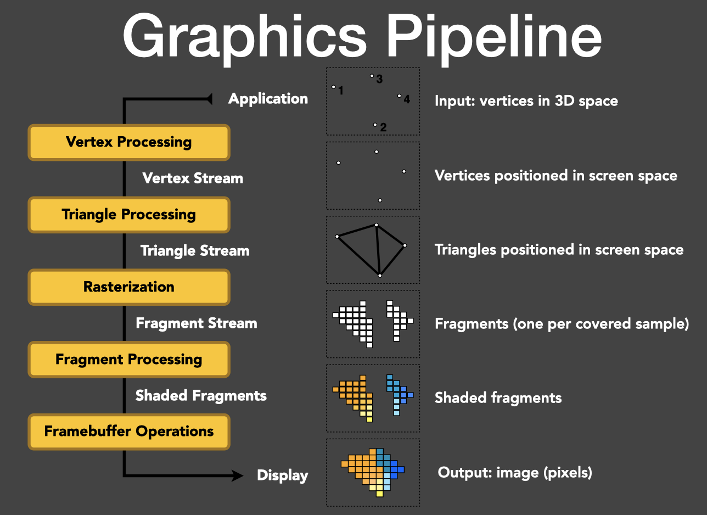

- 顶点数据的输入
- MVP矩阵变换，变换顶点数据的坐标空间
- 将三角形离散化为屏幕上的离散的片元信息
- Z-Buffer测试
- 光照模型
- 纹理映射 Texture mapping 以及利用顶点的数据插值出三角形内部像素点的信息。

## 2 OpenGL

用油画来比喻OpenGL的工作过程：

1. 先将 objects/models 放置好
2. 在合适的地方放置一块画架
3. 在画架上放一块画布
4. 在画布上画画，也就是渲染图片

> - 想用新的画布再画一幅新画，可以将其他的画布放到画架上并重新继续绘画。
> - 还是想在这块画布上画画，但是想调整视角，在移动了画架的方向后，也可以在以前的画布上继续作画。

### 2.1 放置好 objects/models

这一步需要解决的是两个问题：

1、要渲染的物体是什么？

​		使用GPU中的一块区域，叫做VBO, Vertex buffer object，来存储模型信息：顶点数据、法线信息、纹理......

> 使用VBO这种缓冲对象的好处是：可以一次性发送大量数据到显卡上，而不是每个顶点发送一次。
>
> 从CPU把数据发送到显卡的速度相对较慢，所以我们需要一次性发送尽可能多的数据，提高数据传输的速度和效率。
>
> 当数据发送至显卡的内存中后，顶点着色器几乎能立即访问顶点，这是个非常快的过程。

2、物体应该如何摆放？

​		直接调用OpenGL中的接口函数来获取相应的转换矩阵，无需自己再去做什么事情。eg: glTranslate, glMultMatrix, etc.

### 2.2 放置画架

1、视图的转换（画架在哪里就意味着这里是放置照相机的位置）

​		只需调用接口“比如: gluPerspective”即可设置相机（视图变换矩阵）

2、创建并使用 framebuffer（这个framebuffer 就是我们的画架）

### 2.3 将画布放在画架上

- 用同一个画架渲染不同的图。

  意思就是：对场景渲染一次，使用一个framebufer，可以输出很多不同的纹理，可以有一张是shading的结果，可以有一张是深度......

  由 fragment shader 告诉GPU输出的结果最终要写到哪个纹理中去。

  这就是MRT技术（Multiple Render Targets，多重渲染目标），它允许应用程序渲染一次，将结果输出到多个缓冲区。

> 一般都不会建议将framebuffer中的图片直接渲染到屏幕，因为这样可能会出现：这一帧图片都没有渲染完毕，但是出现在了屏幕上的现象，叫做“画面撕裂”。
>
> 游戏中打开“垂直同步”这个选项就可以解决上述问题，背后的原理是：将渲染出的图片先放到一个缓冲区中，当我们确认这个画面绘制完毕后，再从缓冲区中将图片取出，并显示在屏幕上。这个就叫做“双缓冲区”。

### 2.4 在画布上画画

这个就是VS, FS着色器去做的事情了，可以实现很多不同的效果。

- 顶点着色器
  - 顶点如何去做变换
  - 将需要插值的值告诉片段着色器
- 光栅化
- 片元着色器
  - OpenGL已经利用顶点数据将需要插值的地方计算好了。到了片元着色器，我们就认为其中的每个片元信息都是已经计算好了的。
  - 可以自己写深度测试，也可以让OpenGL帮你做深度测试，都是可以的。目前自己写深度测试的情况偏多。

### 2.5 小结

1. 指定物体、相机位置、MVP矩阵等
2. 指定 framebuffer 和 input/output textures
3. 指定 vertex / fragment shaders
4. 渲染！

## 3 GLSL

### 3.1 着色器的介绍

- 顶点着色器
  - attribute（从应用程序传输过来的顶点数据）
    - 顶点位置信息
    - 顶点法线信息
    - 顶点纹理信息
  - varying（需要被插值的数据）
    - 纹理数据
    - 片元位置
    - 法线
  - uniform
    - 全局变量
- 片元着色器
  - varying：接收从顶点着色器传输过来的被插值的信息。

### 3.2 调试着色器

1. 工具介绍

   1. Nsight Graphics

       (cross platform, 只能在NVIDIA GPU上使用 )

   2. RenderDoc

      (cross platform, 在GPU上的使用没有限制)

2. 个人建议

   1. 将所需要的信息转换为颜色进行输出，然后用工具对颜色进行取值，知道输出的数据是多少。

## 4 渲染方程

  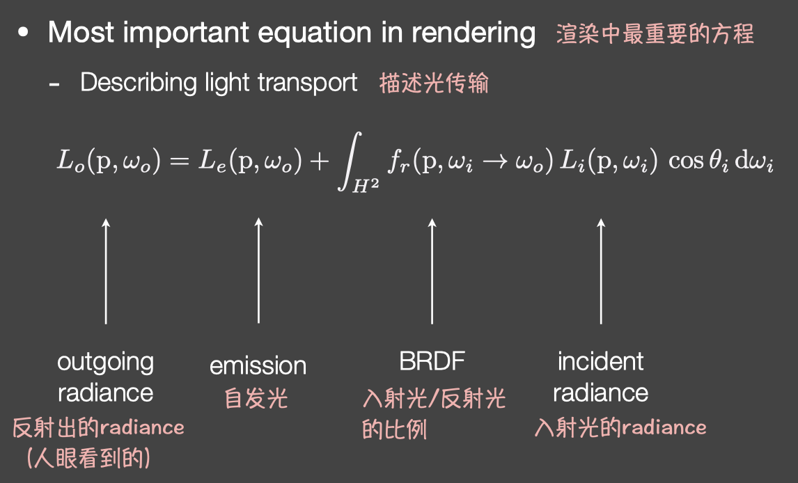
  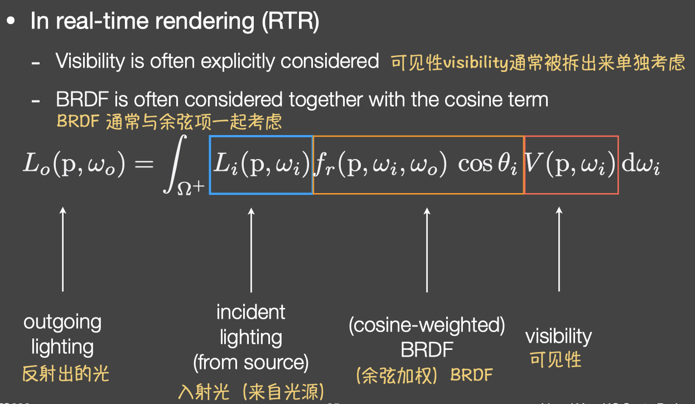

左图：

- 是一个完全正确的用于描述光线传播的方程。
- 描述的是 你看到的这个点 = 这个点自身发出来的光 + 各个方向的入射光打到这一点后 通过BRDF比例计算出的  反射出来的光

右图：In real-time rendering (RTR)

- 可见性通常被单独拎出来明确考虑
  - visibility：从点 P 向 $ω_i$ 方向上去看，这个点能不能被光源照到。
- BRDF通常与余弦项一起考虑

# :white_check_mark: ​Lecture 3: Real-Time Shadows 1

==大纲预览==

- 回顾：Shadow Mapping
  - 它的缺点，以及针对缺点的解决方法
- shadow mapping 背后的数学
- PCSS, Percentage closer soft shadows

## 1 Shadow Mapping

过程：Shadow Mapping是一个需要经过2次渲染的，完全在图像空间中的算法。

- 第一个pass从光源的角度去绘制场景，并生成 depth map。depth map 中的每一个像素只包含了距离光源最近的物体的 z-depth（距离光源的距离）。这个深度图就是 ShadowMap 阴影贴图。
- 第二个pass从观察者角度出发绘制场景，每次渲染一个图元，都去计算它的每一个顶点的位置，在光源的的视椎下的 z-depth，并与阴影贴图做对比，如果这个顶点距离光源距离比相对应的 ShadowMap 中的值更大，说明该物体被遮挡了，即为阴影，否则被照亮。（如果是阴影则该点记为1，否则记为0。）

优点：

- 为了得到场景中的阴影，只需要shadowmap就可以计算出来，而不用知道场景的几何信息。

缺点：

- 自遮挡问题。
- 走样现象，锯齿边缘。

### 1.1 自遮挡

**一、什么是自遮挡现象？**

下图左边地板上的纹路，就是自遮挡现象的产物。

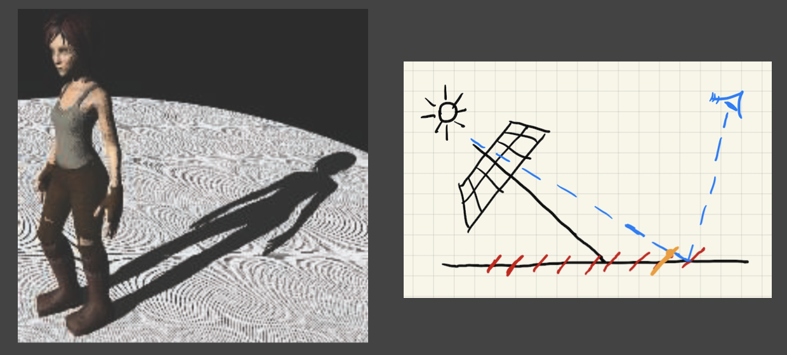

**二、为什么会出现自遮挡现象？**

根本原因：ShadowMap的分辨率不够，因此多个 pixel 会对应 map 上的同一点。

​		ShadowMap上的每个像素中都会记录一个常数来表示场景中的最小深度值。该常数值对应着场景中的一小块区域，而不是一个点。

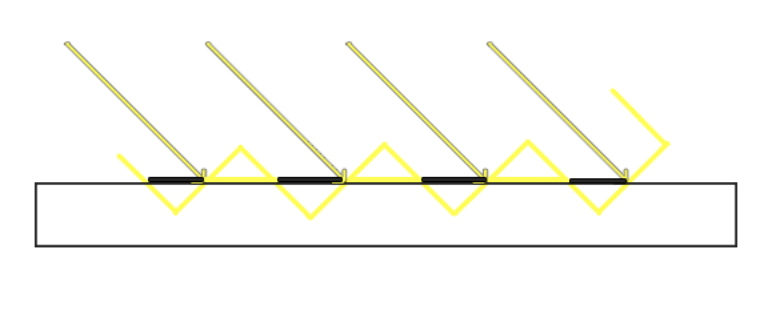

图中黄色箭头是照射的光线，黑色长方形框是实际物体表面，黄色的波浪线是 shadow map中的对应值的情况。

可以看到，由于map是对场景的离散取样，所以黄色的线段呈阶梯状的波浪变化，相对于实际场景中的情况，有一部分比实际场景中的深度要大（对应着黑色线段部分），这部分不会产生阴影（注意图画反了）；一部分比实际场景中的深度要小（对应着黄色线段部分），这部分会产生阴影，所以就出现了条纹状的阴影。

 由于这种情况，是物体的实际深度，与自己的采样深度，相比较不相等（实际深度大于采样深度）导致的，所以可谓是自己（采样的副本）遮挡了自己（实际的物体），所以被称为 self shadowing。

>  什么时候自遮挡现象最严重？什么时候没有自遮挡现象？
>
> - 当光源是垂直从上往下照射地面的时候，没有自遮挡现象。
> - 当光源几乎平行地照向地面的时候，此时自遮挡现象最严重。

**三、解决自遮挡现象的方法？**

只有实际深度大于采样深度的时候才有问题，那么我们在计算实际深度的时候，往灯光方向拉一点，让他减小一点就可以了。

也就是添加一个bias值，只有当0 < |实际深度值 - 采样得到的深度值| < bias 的时候，我们才认为该片段被遮挡了，相当于给了一个缓冲区。

  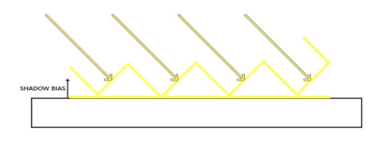
  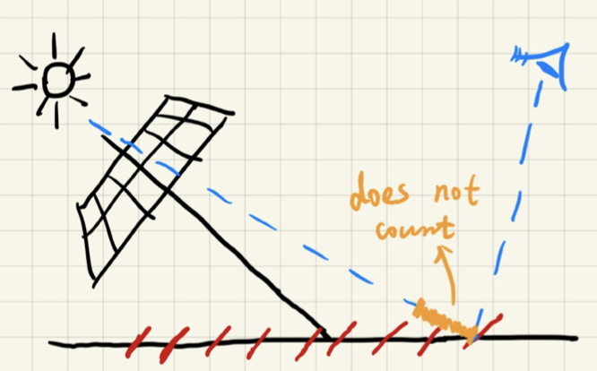

> 【改进】由于当light和地板是垂直的时候，误差最小，那么这个bias值可以很小。当light和地板的夹角比较大的时候，也就是误差会变大的时候，将bias也增大，结果就可以更加灵活和精确一些。

**四、引入上述解决方法后，出现了一个问题**

如下图所示：本应该产生阴影的地方，出现了隔断现象，detached shadow。

1）工业界的解决方法：没有完全真正解决，而是找到一个合适的bias值，使得既没有出现自遮挡，也没有出现detached shadow现象。

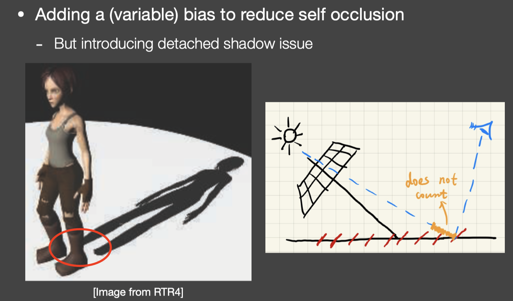

2）学术界的解决方法：Second-depth shadow mapping

​		第一次从光源出发渲染场景的时候，不仅存最小深度，还会存第二小深度。然后用最小深度和第二小深度的中间值，来做后续的阴影比较值。

但是没有人用，因为：

- 它需要物体是watertight。即，物体不能是一张纸，需要有正面有反面，即使你要描述一张纸，也需要用一个盒子来描述表示它。
- 开销可能不值得。因为会涉及到保存和更新最小和次小的深度值，开销会比较大。

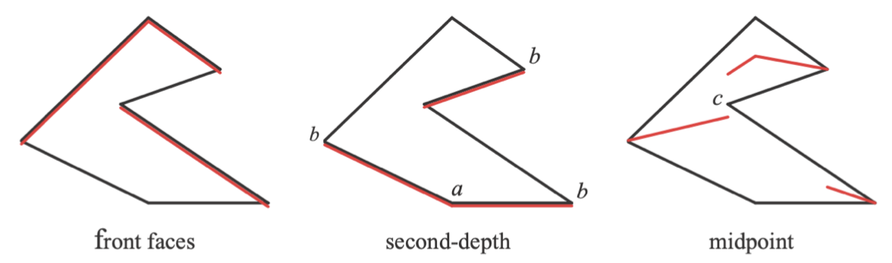

### 1.2 走样

一、走样现象如下图所示：

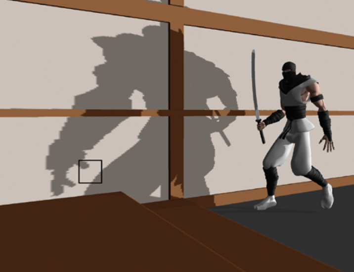

二、阴影走样的解决方法

[PCF](#PCF, Percentage Closer Filtering)

## shadow mapping 背后的数学

一、在微积分中有很多有用的不等式：

1. 两个函数先乘积 后将结果积分的值 < 函数先分别积分 后将结果相乘的值
2. 两个函数先相加 后将结果积分的值 < 函数先分别积分 后将结果相加的值

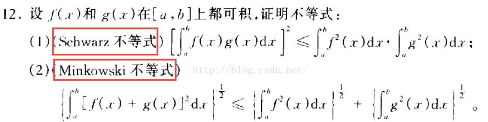

但是在实时渲染中，我们更多关注的是：近似相等。（由于计算量和速度(实时)的关系，我们计算不了过于准确的值，但是可以通过利用一些近似值来减少计算量，从而在提升速度的基础上，又平衡了画面的渲染效果。）

因此我们近似认为上述的不等式可以近似相等为以下的等式：

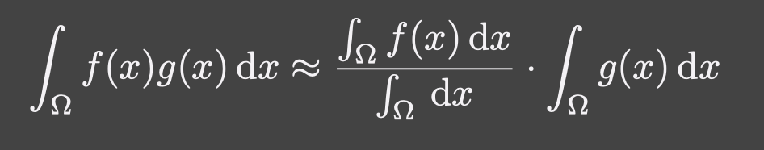

> 什么时候上述等式会更加精确呢？
>
> 满足以下两种条件中的一种时：
>
> 1. 当g(x)的积分范围很小的时候。
> 2. g(x)比较光滑smooth，在范围内变化不是过大。

二、上述知识应用到我们的图形学中，将渲染方程拆出来近似求解。

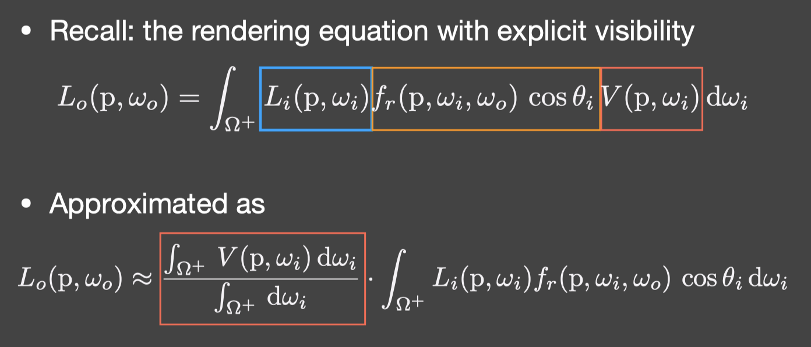

上述的式子什么时候近似得比较准确呢？

1. 积分范围比较小。那就是：光源是点光源或者方向光源的时候。
2. 变化不大，低频。那就是：漫反射bsdf /恒定辐射区域照明

> 会在“环境光遮蔽”中用到。

## 2 软阴影

一、什么是软阴影？

shadow mapping 产生的是硬阴影。软阴影看起来会更加自然，在阴影的边缘会有一个过渡。

>理论上点光源不会形成软阴影。软阴影的必要条件是光源有面积。

二、如何实现软阴影？

### PCF, Percentage Closer Filtering

> - PCF技术用于对阴影边缘做抗锯齿，即反走样技术。
> - PCSS才是用于做软阴影的技术。（PCF有被用于PCSS中）

【注意事项】

1. 不是对最后已经有锯齿的阴影做filter。

   PCF的filtering指的不是对最后得到的图，对那张图做filtering，而是在阴影判断的时候做filtering。（也就是，并非先得到一张走样的结果，然后对走样的地方做模糊操作，并非如此。）

2. 不是对shadow map做filter。

   PCF也不是filter生成的shadow map。（因为对模糊了的shadow map做深度测试，最后得到的结果还是非0即1的，没有改善。）

> Filter(相当于模糊操作)的是与shadow map中深度值的比较操作，在阴影判断的时候做filter。

【PCF 原理】

之前判断shading point是否在阴影中的做法是：将该点连向light，并与shadow map上对应的点的深度值进行比较。

**PCF的做法（区别）**：该点投影到shadow map后，不是找对应的那**一个像素**，而是找周围**一圈的像素**。比如7x7的像素块中，将这个像素块中的每一个像素深度值都与该点做比较。然后把做完比较的值（该值非0即1）给平均起来（平均值在0到1之间）。

例如：有一个点P在平面上，

1. 取点P周围3×3区域，并将该区域的每个像素点的深度值与shading point的深度值一一比较。

2. 得到
   $$
   \left[
    \begin{matrix}
      1 & 0 & 1 \\
      1 & 0 & 1 \\
      1 & 1 & 0
     \end{matrix}
     \right]
   $$
   
3. 然后取一个平均结果，得到 0.667

这样它的值就不是之前的非0即1了，而是在0~1之间的值。

【观察结论】

- 如果filter的区间越小，如1×1，那就相当于没做模糊，阴影边缘会很锐利。
- 如果filter的区间越大，那么越接近软阴影，边缘会更加模糊。（因此可以利用PCF来实现软阴影）

> 问题：filter的正确区间应该是多少？PCSS中解答。
> PCF的缺点是开销很大，比较慢，解决方法也和PCSS一起介绍。

### PCSS, Percentage Closer Soft Shadows

【主要思想】

Filter size 与 “遮挡物和阴影接收物之间的距离” 有关系。（也就是“笔”和“阴影投射到的纸”间的距离）

不同的地方需要有不同的效果，比如笔尖处的阴影比较锐利，那么它的filter的范围会较小。笔杆处的阴影边缘比较模糊，它的filter的范围需要比较大。

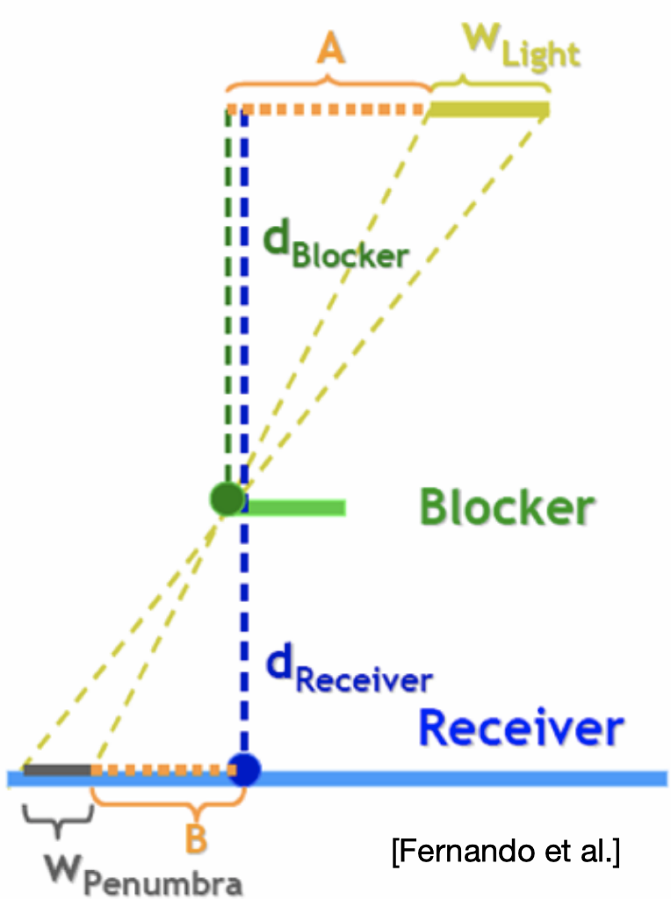

利用上图中上下的两个相似三角形，可得到如下数学等式。
$$
w_{Penumbra}=\frac{(d_{Receiver}-d_{Blocker})·w_{Light}}{d_{Blocker}}
$$
🔺从公式可以看出：

1. 当light很大的时候，$w_{Penumbra}$阴影filter也更大些。
2. 当Blocker更靠近阴影接收物时，$w_{Penumbra}$更小，阴影filter范围也更小，阴影表现得更锐利些。

> 解决了“该filter多大的区间”这个问题。**这取决于light的大小，也取决于blockers和阴影接收物之间的距离。**

#### 算法步骤

PCSS的完整算法步骤：

1. 找到blocker。

   - 从shading point连向点光源，取周围一个特定范围的区域，逐像素判断该像素点是否在软阴影里。在的话，就认为找到的像素是blocker。
   - 将该区域内所有blocker的深度值都记录下来，取平均值。

2. 估计filter范围。

   使用所有blocker的平均深度值来确定filter的范围。

3. PCF操作。

   已经知道filter的范围了，接下来就是PCF操作。

   

> 那么现在需要解决的问题是：第一步中，应该在多大范围内做search。

- 方法一：直接取一个固定大小范围，比如：5x5。

- 方法二：用heuristics。如下图所示：

  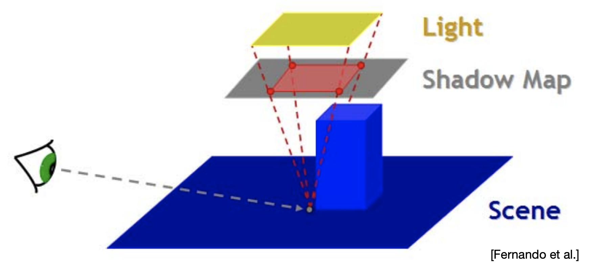

  需要找到在红色区域的范围里，所有能挡住shading point的点。现在的问题是：红色区域应该取多大？

  【解决方案】将light看作点光源，shading point连向光源light，看它在shadow map上覆盖了一个多大的区域。这个区域就是我们要找的blocker search。

# :white_check_mark: Lecture 4: Real-Time Shadows 2

==大纲预览==

- More on PCF and PCSS
- VSSM, Variance soft shadow mapping
- MIPMAP and Summed-Area Variance Shadow Maps
- Moment shadow mapping

## 1 More on PCF and PCSS

### 1.1 A Deeper Look at PCF

【回顾】PCF做了什么？如下图所示：点`x`投影到shadow map上对应的是像素`p`。但此时不但只考虑`p`的深度值，还会考虑`p`周围一圈的像素深度值，并都和`x`进行深度值比较，后将这些像素的深度比较结果贡献值进行**加权**，求平均值。（加权：距离p点近一些的像素点贡献更大）

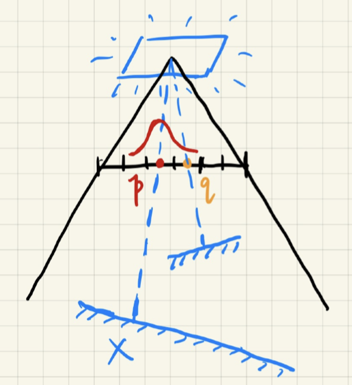

【背后的数学】

① PCF

在固定范围内采样多个点的深度值，然后将比较后的结果进行加权求平均。

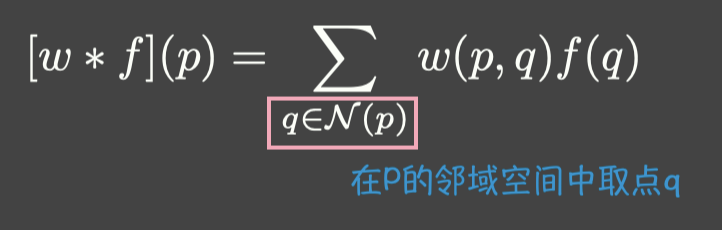

> 同时也可以看出：
>
> 1. PCF不是去对shadow map做filter。（因为对模糊后的值做比较，最后还是非0即1，而不是0~1的中间值，并不能做软阴影。）
> 2. PCF也不是对最后生成的图形上的锯齿做filter。（模糊操作）

② PCSS

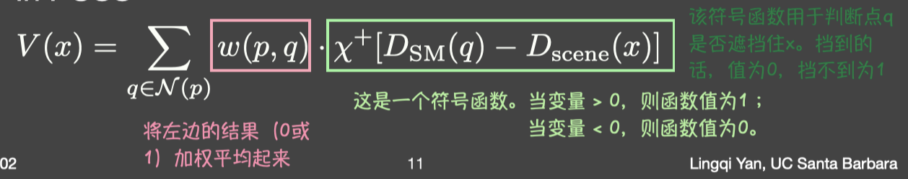

### 1.2 Revisiting PCSS

【PCSS的完整算法步骤】

1. 在shadow map周围取某一大小的区域，那么这个区域里大概有多少blocker，并算出blocker的平均深度。
2. 用blocker的深度值来评估出第三步的filter范围。
3. PCF操作：在评估出的范围内，采样多个点的深度值，和shading point进行比较，后将比较后的结果进行加权求平均。

【缺点：速度问题】

PCSS中的第①步和第③步都会比较慢。因为都需要对区域内的texel记录的深度进行一一比较。

阴影越软，需要filter的范围越大，速度越慢。

- 工业界的做法：对区域内进行稀疏采样，只看区域内的某些texel，降低访问texel的次数。
  但采样不足会使最后生成的图像有“噪声noisy”现象，此时会用到图像空间的降噪处理。(:triangular_flag_on_post:在Real-time Ray Tracing会讲到)
- 学术界的解决方式：VSSM

## 2 VSSM, Variance soft shadow mapping 

> 为了解决PCSS中第①步和第③步都很慢而提出的方法。

### 2.1 大胆假设：正态分布

> 但是要知道最后并没有用正态分布来估计，而是切比雪夫不等式！

在第③步中的PCF，访问texel是为了解决这个问题：***有百分之多少texel的深度值要比shading point的深度值更浅。***

问题的另一种看待方法：这个问题还可用“柱状图”来表示，从而获得准确的答案。
再进一步**<u>大胆假设</u>，**直接使用正态分布函数来近似最终区域内各点深度值的分布结果。

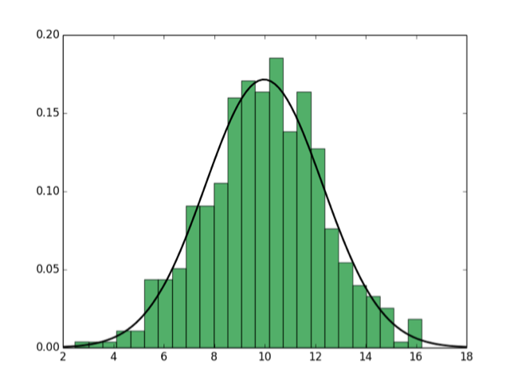

那么，如果你需要定义一个正态分布函数，需要什么信息呢？
① 均值（期望）$E(X)$   ② 方差 $Var(X)$

#### 计算期望和方差

> 问题进一步转化为：如何快速计算出该区域中的均值和方差？

【计算指定区域中平均值的两种方法】

1. [硬件上的mipmap](#mipmap)
   1. 有不同层级间的插值，结果不准确
   2. 只能做方形区域的查询
2. SAT, Summed Area Tables（✅ 更优秀）
   1. 结果计算精准
   2. 方形和矩形的平均值查询都可

【计算指定区域中方差的方法】
$$
Var(X)=E(X^2)-E^2(X)
$$
利用上述公式，已知$E(X)$，那么只需要再求得$E(X^2)$，就可知道方差值。

方法：需要一张shadow map，它记录的不再是$depth$，而是$depth^2$ 。（其实都不需要用额外的texture，直接写在另一个通道里即可。RGB中，R存储$depth$值，G通道存储$depth^2$，无额外存储开销。）

#### 切比雪夫不等式近似求面积

> 现在已经知道了该区域内各点深度值的正态分布结果，那么回到问题本身：**有多少百分比的texel比shading point的深度值小？**比该点更靠近光源？有多少百分比texel能够遮挡住shading point？

计算下图阴影部分的面积，面积就是百分比的结果。

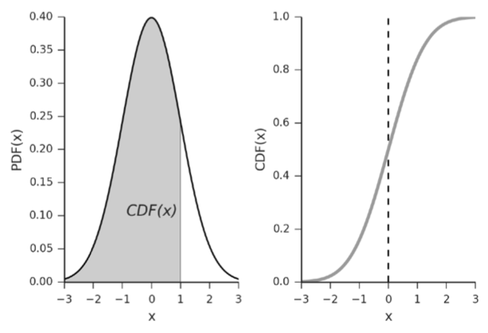

这个结果其实并不需要那么精确。为了估算最终阴影部分的面积，用到了切比雪夫不等式：
$$
P(x>t) ≤ \frac{𝜎^2}{𝜎^2+(t-µ)^2}
$$
该等式告诉：该面积不会超过该公式。

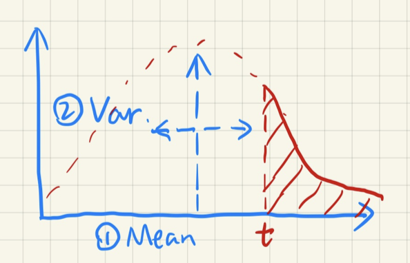

切比雪夫不等式：你不必知道它是否是正态分布，或者是其他的分布，只需要知道它的均值和方差，就可以近似求得CDF的值。

> 切比雪夫不等式可用于描述**<u>一个随机变量它取的值超过某一个值的概率</u>**。

☆较严苛的使用条件：查询的值必须在均值的右边，如果在左边就会不准。

### 2.2 算法性能表现

1. **shadow map的生成**

   1. 为了求得方差公式中的$E(X^2)$，在得到深度贴图$depth$的同时，还要同时求得并记录$depth^2$的值。
   2. mipmap and SAT（:triangular_flag_on_post:计算期望$E(X)$的方法，[接下来会介绍](#mipmap)）

2. 运行时间   

   1. 查询并求得给定范围内的深度平均值：$O(1)$

   2. 查询并求得给定范围内的深度平方的均值：$O(1)$

   3. 求得切比雪夫不等式：$O(1)$

      假设该公式告诉我：有30%的texel能挡住这一shading point，那么该点的可见性visibility就是0.7。

   > 因此：第③步不需要做任何的采样操作！

### 2.3 回到第①步：blocker search

- 第①步操作中也会用到采样sampling (loop)，也很低效。
- 求的是**<u>遮挡物</u>**的平均深度（下图蓝色部分），不是整个的平均深度。

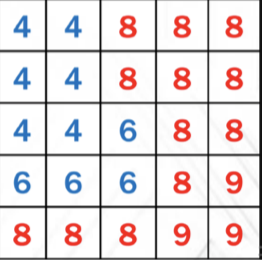

【核心思想】

- Blocker(z < t) 遮挡物的平均深度, 记作$Z_{occ}$ （:white_check_mark:我们想计算的）
- Non-blocker(z > t) 非遮挡物的平均深度, 记作$Z_{unocc}$
- 两者会满足下面的等式：

$$
\frac{N_1}{N}Z_{unocc}+\frac{N_2}{N}Z_{occ}=Z_{Avg}
$$

【计算$Z_{occ}$】

- Approximation: $\frac{N_1}{N} = P(x>t)$ 没有遮挡point的占了多大比例，可以对应到之前介绍的<u>切比雪夫不等式</u>。
- Approximation: 那么可直接求得$\frac{N_2}{N} = 1-P(x>t)$ 
- $Z_{unocc}$ 不知道
- Approximation: 假设$Z_{unocc}$ 的深度和当前shading point的深度值一样。（绝大多数的阴影接收者是个平面）
- **最后等式中只剩下$Z_{occ}$**，直接解不等式就可求得。

> 这种方法也避免了第①步中的采样操作，额外开销可忽略不计。

## 2(续) MIPMAP and SAT

> 为了解决上述的遗留问题：如何快速得到一个范围内的均值$E(X)$。

解决方法：

- MIPMAP
- Summed Area Table (SAT)

### 1）MIPMAP for Range Query

mipmap可以做**快速的、近似的、正方形**范围查询。

这种方法做不到百分百准确，因为它要做插值。

- 如果要知道2.6层的数据，那么就需要三线性插值，在2层和3层之间插值，数据更不准确。

- 而且需要是正方形范围内的查询，如果是长方形等形状，结果更不准。但可用各向异性过滤来解决这个问题。

### 2）SAT for Range Query

> 百分百准确的方式。

【经典数据结构和算法（总和）】

> 知道了总和，直接用总和除以数字，自然得到均值。

#### 一维情况

如何求得下图一维数组中3~1的总和呢？

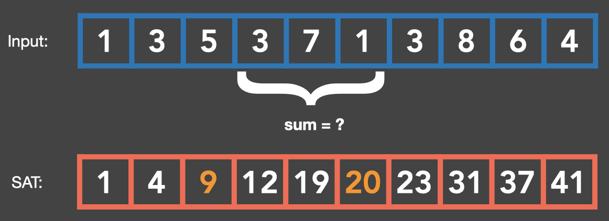

SAT表格中存储的是：从左到右加到该元素的总和。（预计算）

那么，3~1的和 = 20 - 9 = 11 = 3+7+！

#### 二维情况

如何求得下图中蓝色部分的面积呢？

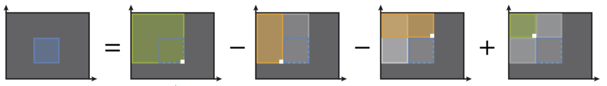

此时SAT表中存储的是：元素值从左上角加到这个元素的整个矩形的面积值。

那么，蓝色部分的面积 = 通过查询对应的元素值，查询4次，就可通过计算得出。

【优点】计算出的结果很精确

【缺点】

1. 需要$O(n)$个时间

   n为所有的元素个数，行列表示的话那就是$O(m×n)$

2. 需要存储二维图像。

   存储可能不是问题。

> 那么我们有什么办法可以加速吗？
>
> 行计算可以并行执行。

## 3 Moment shadow mapping

### 3.1 Revisit: VSSM

【VSSM结果不准确的两点原因】

1、在VSSM中做了很多的假设，那么当假设的前提出现问题的时候，通过该假设得出的结论也会有问题。

如下图，左边的情况通过VSSM来描述没有问题，该shading point的分布和我们假设的分布很近似。但是右边的图通过VSSM来描述就出现问题了，因为该shading point的分布和我们假设的分布情况完全不一样。

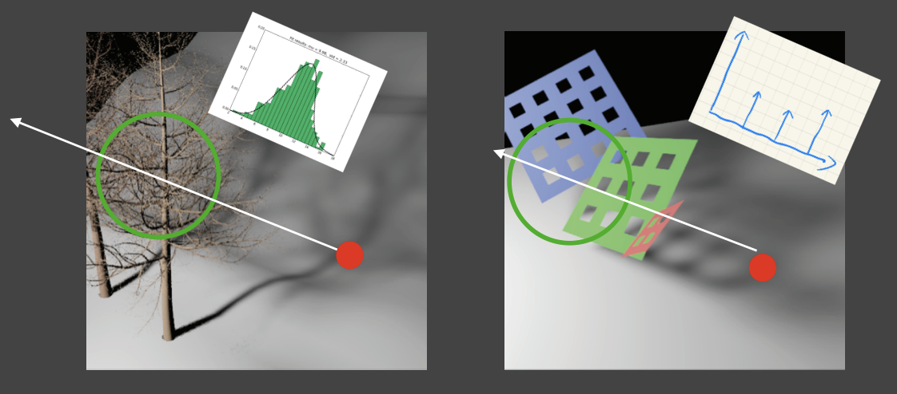

【深度分布不正确时会出现问题】

- 过黑。这种情况还可以接受 :white_check_mark:
- 过亮过白。场景会很奇怪，不能忍！:x:

2、只有当查询值超过平均深度的时候，切比雪夫不等式才是准的，否则结果可能也不准。

### 3.2 MSM，更准确地表示分布

> MSM解决问题的目标：将深度分布描述得更准。

方法：使用更高阶的矩(moments)去描述一个分布。（这个矩不是矩阵的意思）

**1、什么是Moments？**

- 有很多种定义

- 我们使用最简单的：
  $$
  x, x^2, x^3, x^4, ...
  $$

  > 多记录几阶，对分布的近似会描述更准。

- 之前介绍的VSSM方法本质上使用的是前两阶的矩。

**2、Moments可以用来做什么？**

【结论**】前m阶的矩，可以描述一个有$\frac{m}{2}$个台阶的函数。**

如下绿色的曲线图，表示的是4阶的，曲线图有4/2 = 2个台阶。

**<u>通常情况下，4阶矩足以逼近深度的实际CDF。</u>**

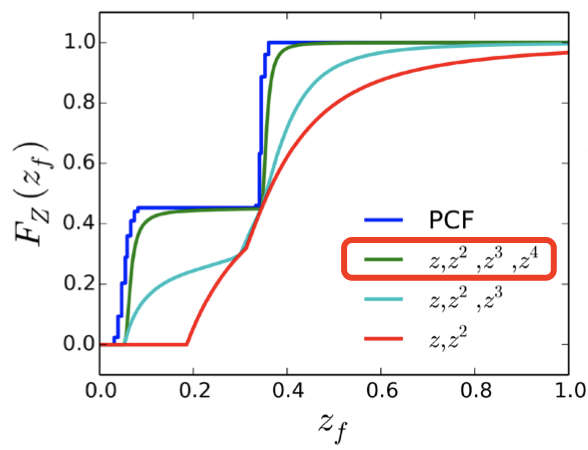

> 不能无限多，因为有存储问题。

【小结】

- MSM对VSSM有着更精准的估计
- 生成shadow map的时候，记录$z, z^2, z^3,z^4$
- 在blocker search 和 PCF的过程中存储CDF。

**3、MSM的优点和缺点**

- 优点

  - 得到非常好的结果

- 缺点

  - 存储开销（也不是很大的问题）

  - 问题在于：给你前4阶矩，如何得到有两个台阶的函数？

    计算出这个函数是非常复杂的。

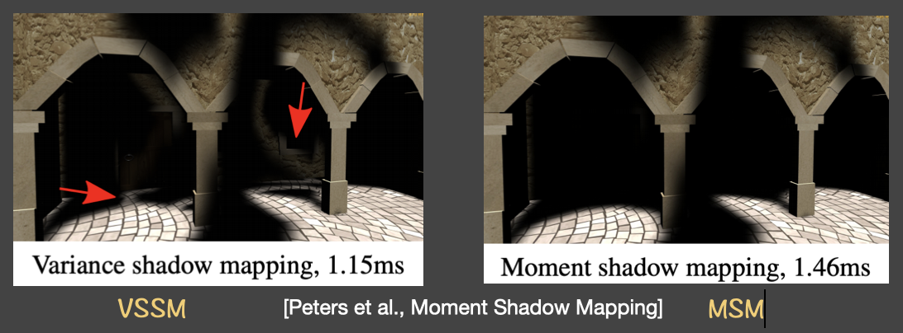

# :x: Lecture 5: Real-Time Environment Mapping

==大纲预览==

- Finishing up on shadows 继续讲解完软阴影生成的部分
  - Distance field soft shadows 
  
    介绍新的生成软阴影的方法，该方法应用广泛，前景光明。
- Shading from environment lighting 开始讲解：环境光照下的阴影
  - The split sum approximation
- Shadow from environment lighting

## 续4：Distance field soft shadows

**==1、为什么需要Distance field soft shadows？==**

**<u>用于软阴影的生成。</u>**

该方法的优点是：

- 比传统的shadow map快
- 没有自遮挡或阴影悬浮等问题

缺点是：SDF的存储会占用较大的空间。

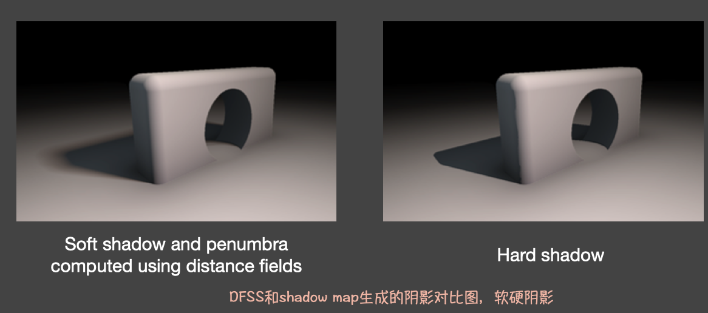

**==2、什么是Distance field ？==**

### 1 介绍 Distance Function

**它定义了在空间中的任意一个点，该点到某一物体表面的最短距离。**

带正负号的距离，有向距离，用正负号表示该点在物体内部还是外部。该点在物体内部记作+，在物体外部记作-。

> （这部分在GAMES101中讲过 —— Distance Function, 距离函数）

SDF可以做任意形状物体的blending，无需关注物体间的拓扑关系，就能得到很好的几何上的边缘过渡。

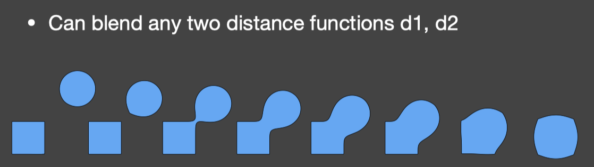

**==3、为什么要用SDF？如何用？==**

### 2 SDF的几种用法

#### 1）用于Ray Marching

> 已知该场景的SDF，现有一根光线，用该光线和SDF定义的隐式表面求交。

如何计算求交呢？

安全距离，逐步前进。

SDF告诉我们：在任意一个点，以该原点为中心，该点上SDF的值为半径画圆。在该圆圈内是安全距离，不会与任何物体表面相交。

那么就可以以SDF的值为安全的步长距离，逐步向物体靠近，直到SDF的值足够小，就认为光线和物体相交了。

> 运动的物体可以用SDF，形变的物体不可以用。

#### 2）用于生成软阴影🔺 

【原理】用SDF来近似得到***大概***有多少范围被挡住。

【思路】由SDF的值 ➔ 得到从眼睛看向场景的一个安全角度 ➔ 得到近似的阴影值

【结论】观察得到：**<u>安全角度越小</u>**，就认为看到的东西越少，意味着被遮挡的物体越多，**<u>阴影就越黑。</u>**

##### 近似计算安全角度

> 在Ray Marching中，从观察点出发，对圆做切线，然后逐步计算安全角度$\theta_1$, $\theta_2$$, \theta_3$，并求得其中的最小值。
>
> 那么：如何求得安全角度呢？

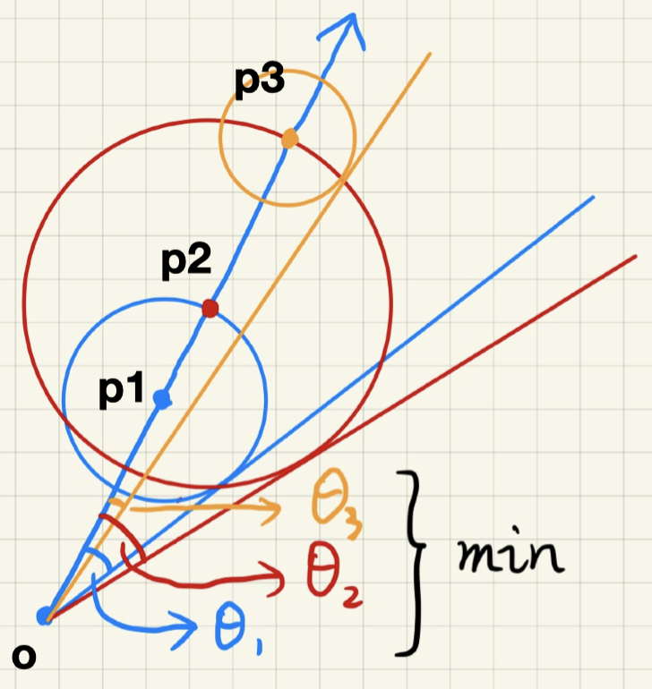

原来的思路：
$$
arcsin \frac{SDF(p)}{| p - o|}
\tag{×}
$$
但是计算过于复杂，可以用下面的公式来近似计算安全角度，更简单：
$$
min\{\frac{k・SDF(p)}{| p - o|}, 1.0\}
\tag{√}
$$

> k 的作用：<u>**k越大**</u>，那么很小的安全距离也会被当做1，0~1之间的过渡带自然会少，**<u>阴影越硬</u>**。

【结论】k可以用于控制阴影的软硬程度。

#### 3）interesting application：抗锯齿字符

一个github上的开源项目，用SDF来做抗锯齿效果，使得不管分辨率多大，都可以很清楚地看清字符边界。

### 3 SDF的优缺点

【优点】

- **快**

  比shadow map更快，不是在查询上，而是生成shadow map比较慢。

- 高质量

【缺点】

- 需要预计算

- **需要大量的存储空间**

  SDF是三维距离场，三维纹理的存储很复杂，一般可用八叉树或K-d树来存储。

- 出现artifact情况（未具体介绍）

  

**Some Questions**

> 计算空间中某个点的距离场是要遍历所有的物体吗？
>
> 不需要。完全可以每个物体单独计算，然后取其中的最小值，就是该点的SDF值。

> SDF的假设更大胆，它实现的阴影效果比PCSS的效果更假一些。

## 新：环境光照下的阴影

### 1 回顾：环境光照

- 用一张图来记录从任一方向看可以看到的光照信息。

  （认为光照都是来自无限远的。）

- 两种主流的记录环境光的方式

  1. 球面贴图
  2. 立方体贴图

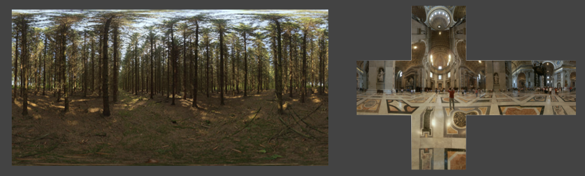

一个物体被放置在环境中，不考虑遮挡的情况下，计算它的shading。这种操作方式在工业界被称作：IBL, Image-Based Lighting。

### 2 提出问题：如何计算每个点的着色值

==【要解决的问题】== 

**现在，已经有了IBL，如何拿到任何一个物体上的任何一个shading point的shading值？**

【解决方式】

解渲染方程 。(第2课中有讲过，可见性通常被拎出来单独考虑)

- 只考虑来自上半球的光照
- 不考虑visibility

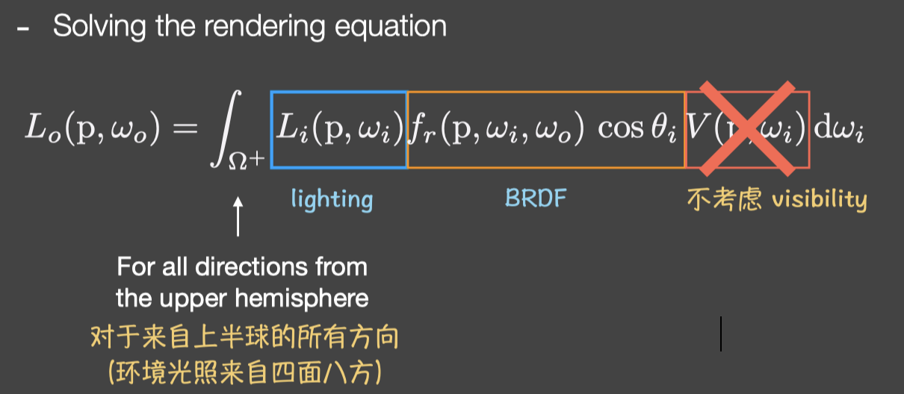

【如何解渲染方程呢】

- **通用解法 —— 蒙特卡罗积分**

  对于任何一个积分都可以拿 满足任何分布的 任何PDF的样本，对它做数值上的近似。（并且这个近似是无偏的）

  - 需要大量的样本，才可以接近期望的值。

- 问题 —— 这种方法会非常的慢

  - 通常来说，在shaders中出现采样sampling的话，这种方法很可能不能被用在实时渲染中。
  - <u>那么，我们可以采用一些别的方法避免sampling吗？</u>

#### 经典的近似方案

通过观察可以知道：

- 如果BRDF是glossy的 —— 入射光是黑色，反射出去的光是蓝色的区域。
- 如果BRDF是diffuse的 —— 入射光打到这个点上，该光线会向四面八方反射，反射的区域是整个半圆。—— 会很smooth（变化比较小）

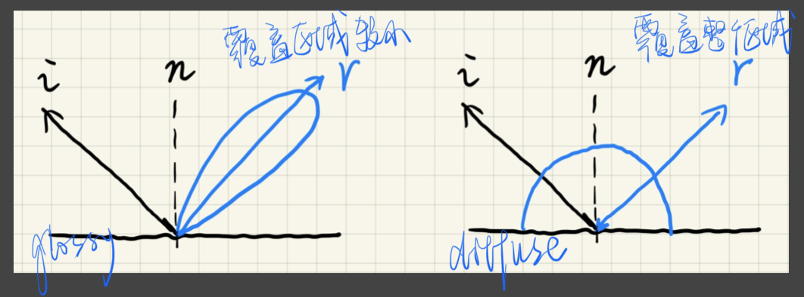

通过上述观察出的特点，可以联想到之前提过的[公式](#smooth)：

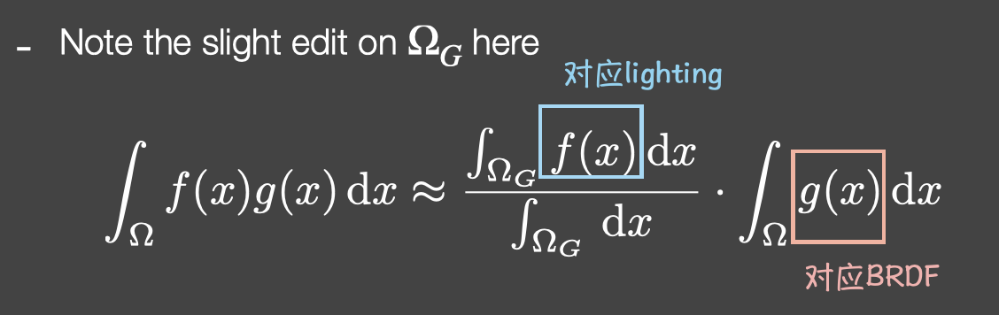

- 当g(x)满足以下条件时，该公式的近似结果会比较准确。
  1. g(x)的积分范围很小。
  2. g(x)比较光滑smooth，在范围内的变化不是过大。

> BRDF十分满足上述的两条性质。

#### 2.1 分割和（第一阶段: 拆分lighting）

BRDF在任何情况下都满足精度条件，因此根据上述近似公式，我们可以放心地将lighting部分拆出来。

之前的：

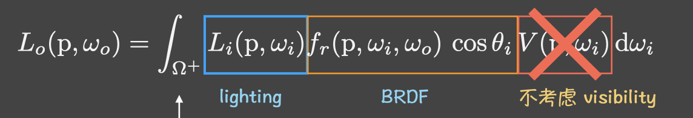

将light单独拆分出来：

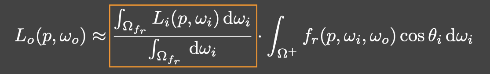

> Ps：区分一下阴影中的拆分项。阴影中拆出来的是visibility项。
>
> 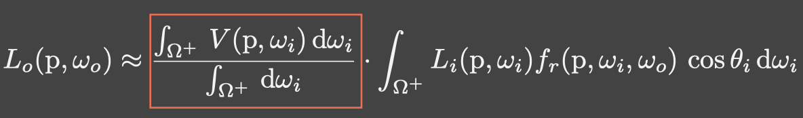

拆出来后的好处是：黄色的框和BRDF就一点关系都没有了，两者可以分开考虑。

拆出来的项表示：在light所表示的整个球上，BRDF的lobe所覆盖的某个区域，将这个区域的light给积分起来，并且将它normalize。

##### 对IBL进行滤波操作

将IBL所表示的这张图进行模糊操作：任何一个点上取它周边的一片范围，然后把范围中的平均值写回该点。

- 滤波环境光（这张图在渲染前就filter好）

  - 对环境光做filter（滤波操作），滤波核多大取决于BRDF占多大。

  - 预先生成一组不同滤波核下的环境光图片（就是被模糊成不同程度的环境光图，如下所示）

    lighting先做不同大小的filtering，需要用到的时候直接去查询，查它任意大小filter后的值。

  - 两者之间的滤波核大小可以通过三线性插值来近似。

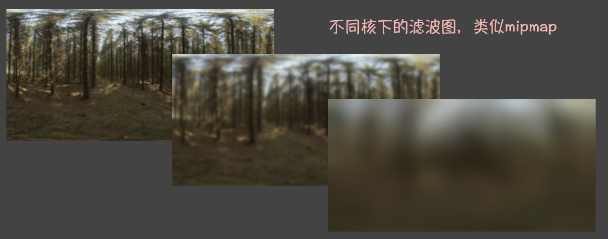

> 小结：做拆分能干什么？能让lighting做prefiltering。
>
> 那么做prefiltering能干啥呢？👇

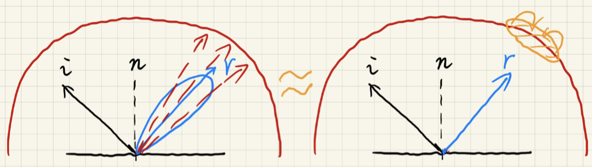

左边的图：从某一个方向看shading point，它的BRDF应该是某种lobe。我们想精准地算出来这个点的颜色值要怎么操作？采样这个BRDF的lobe，将最后采样的所有值做一个加权平均，然后就可以得到shading point的值了。

右边的图：将environment lighting
先做好一个filtering，任何一个点都是它周围一系列点的加权平均。然后就直接“在镜面反射的方向上”去查一次，就可得到结果。（用于近似左边的结果）

此时查的值是之前已经 filter好的值，这就是prefiltering的意义。

> 【小结】那么lighting这一部分已经被解决了。
> 先对IBL做prefiltering，然后需要查任何多大的一块区域内filter出来的结果时，直接在镜面反射的方向上做一次查询，就可得到结果。

#### 2.2 分割和（第二阶段: 拆分BRDF）

第二项仍然是一个积分，要如何在这一项中避免sampling操作呢？

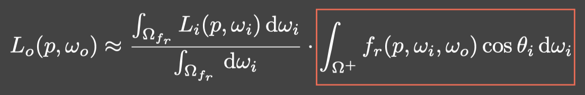

思想（暴力的预计算）

- 为变量粗糙度、颜色（菲涅耳项）等的所有可能的组合预先计算其值。
- 但参数空间维度很高，也需要一张非常大的table来存储。

> 因此不能预计算，但是我们想办法让它能预计算。

##### 回顾：BRDF

初始反射率：$R_0$

曲线如何往上涨：$(1-cosθ)^5$

BRDF中重要的几个变量：

- 入射角度 $cosθ$
- 基础反射率 $R_0$
- 物体的粗糙程度 $α^2$

预计算刚刚的积分，对每个点都计算出上面的几个变量。就变成了三维的变量。

> 但是三维的预计算也很麻烦，想要继续降低预计算的维度。

##### 主要思想

- 想要降低维度就可以：尝试继续拆分变量
- Schlick近似菲涅尔项更简单：只需要

将Schlick近似项直接代入到上述的最右边的公式项中：

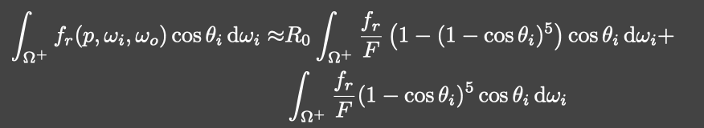

